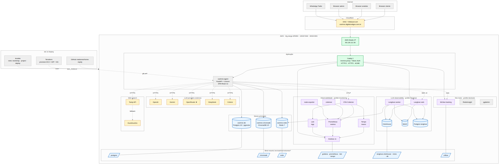
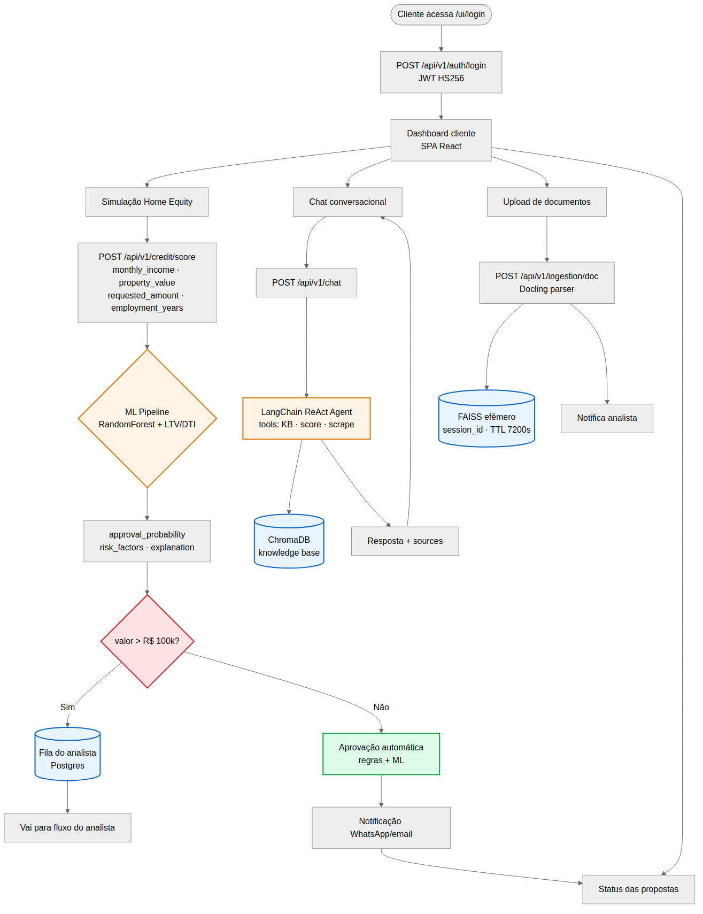
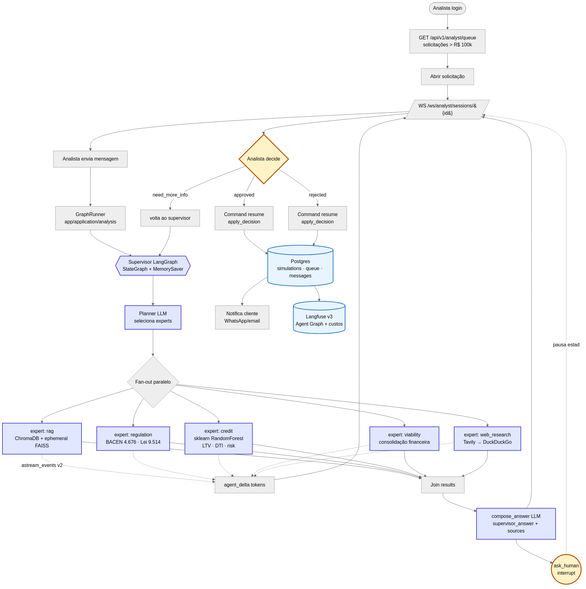
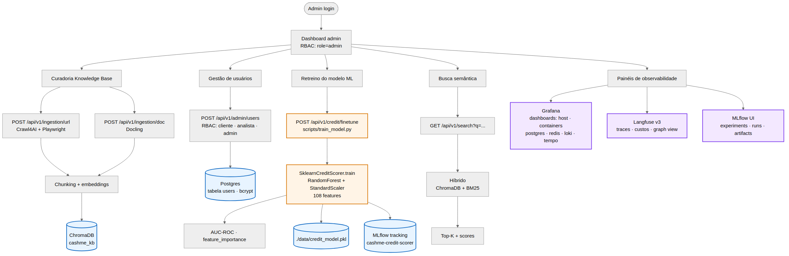

# Equity Credit Intelligence Agent — v2

Plataforma de análise de crédito imobiliário (**Home Equity**) construída em **Clean Architecture** com três personas (**cliente**, **analista**, **admin**), agente **multi-expert** orquestrado por **LangGraph + Human-in-the-Loop**, **múltiplos LLMs**, **RAG híbrido** (ChromaDB persistente + FAISS efêmero por sessão), **web scraping**, **parsing de documentos**, **Machine Learning** e uma **SPA React** com autenticação JWT.

Projeto construído como POC técnica para a cargo de **Engenheiro de IA**, cobrindo de ponta a ponta o stack descrito para um engenheiro de IA, com infra observável, IaC para deploy AWS (Terraform + Ansible) e limites de recursos configurados para rodar em uma workstation.

> 📖 **[Guia passo-a-passo para subir e testar tudo](./GUIDE.md)** &nbsp;·&nbsp;
> 🏗️ **[Diagrama de arquitetura (drawio)](./.arch/architecture.drawio)**
> &nbsp;·&nbsp; 🔧 Zero hardcode: tudo em `.env` + factory em
> [app/infrastructure/llm/providers.py](app/infrastructure/llm/providers.py)
> &nbsp;·&nbsp; ✅ Demo produção: <https://ip/ui/login>
> &nbsp;·&nbsp; 🔐 Basic-Auth Caddy nos painéis

## 📑 Sumário

1. [Contexto de negócio](#1-contexto-de-negócio)
2. [Arquitetura técnica](#2-arquitetura-técnica)
3. [Stack tecnológico](#3-stack-tecnológico)
4. [Endpoints REST](#4-endpoints)
5. [Como rodar localmente](#5-como-rodar)
6. [Estrutura do projeto](#6-estrutura-do-projeto)
7. [Interface web (SPA React)](#7-interface-web-spa-react)
8. [Aderência à vaga](#8-aderência-à-vaga)
9. [Roadmap](#9-roadmap--próximos-passos)
10. [Observabilidade local](#10-observabilidade--stack-local)
11. [Dev tools](#11-dev-tools--inspeção-de-dados--ml-observability)
12. [Resource limits Docker](#12-resource-limits-docker)
13. [Todas as URLs de acesso](#13-todas-as-urls-de-acesso)
14. [Deploy na AWS — VM única](#14-deploy-na-aws--vm-única-implementado)
15. [Operação em produção](#15-operação-em-produção)
16. [Fluxos de negócio possíveis](#16-fluxos-de-negócio-possíveis)
17. [Licença](#17-licença)

---

## 1. Contexto de Negócio

A **Equity** é a maior fintech de crédito com garantia imobiliária do Brasil. O produto principal — **Home Equity** — permite ao cliente usar seu imóvel como garantia para obter crédito com taxas mais baixas e prazos maiores que modalidades tradicionais.

Este agente resolve dores concretas da jornada de crédito:

| Dor do negócio | Como o agente resolve |
|---|---|
| Cliente não entende o produto Home Equity | Chat conversacional com RAG sobre base de conhecimento institucional |
| Analistas consultam múltiplas fontes (PDFs, sites, normas Bacen) | **LangGraph supervisor** orquestra 5 especialistas (rag, regulation, credit, viability, web_research) em paralelo, com citações |
| Pré-análise de crédito manual e demorada | Modelo de ML (sklearn) + regras (LTV, DTI) e roteamento automático para fila do analista quando valor > threshold |
| Necessidade de explicabilidade regulatória | Resposta do score inclui `risk_factors`, `explanation` e fontes (Res. BACEN 4.676/2018, Lei 9.514/1997) |
| Decisão final precisa ser humana e auditável | **Human-in-the-loop** via `langgraph.interrupt()` — supervisor compõe parecer, analista decide aprovar/reprovar com justificativa, tudo persistido |
| Sigilo do cliente em consultas RAG | **Índice FAISS efêmero por `session_id`** (TTL 7200s) — anexos da sessão não vazam para outras conversas |
| Experimentação com múltiplos LLMs | Factory unificada OpenAI / Gemini / DeepSeek / Cohere / **OpenRouter** (200+ modelos free/pago) + embeddings local (sentence-transformers) |

**Personas atendidas (RBAC via JWT):**
- **`cliente`** — simulação, chat, envio de documentos, acompanhamento de propostas.
- **`analista`** — fila de solicitações acima do threshold, sessão WebSocket com supervisor multi-agente, decisão HITL.
- **`admin`** — curadoria da KB, busca semântica, gestão de usuários, retreino do modelo ML.

---

## 2. Arquitetura Técnica

O projeto segue **Clean Architecture** com 4 camadas bem isoladas (`presentation` → `application` → `domain` ← `infrastructure`). Tudo orquestrado por um **container** de DI (`app/container.py`) que monta os use-cases injetando portas concretas.

### 2.1. Visão geral (high-level)

```
   ┌──────────────────────────────────────────────────────────────────────────┐
   │   CLIENTES                                                               │
   │  ┌────────────┐   ┌────────────┐   ┌────────────┐   ┌────────────────┐   │
   │  │ Browser    │   │ Browser    │   │ Browser    │   │ WhatsApp       │   │
   │  │ (cliente)  │   │ (analista) │   │ (admin)    │   │ (Twilio/Meta)  │   │
   │  └─────┬──────┘   └─────┬──────┘   └─────┬──────┘   └────────┬───────┘   │
   └────────┼────────────────┼────────────────┼──────────────────┼───────────┘
            │ HTTPS          │ HTTPS+WS       │ HTTPS            │ Webhook
            ▼                ▼                ▼                  ▼
       ┌─────────────────────────────────────────────────────────────────┐
       │  Caddy 2 (reverse-proxy + Basic-Auth nos painéis admin)         │
       │  domain · ip                  │
       └────┬────────────┬────────────┬──────────────────┬───────────────┘
            │ /api/v1    │ /ui        │ /grafana         │ /langfuse
            │ /ws        │ /docs      │ /prometheus      │
            ▼            ▼            ▼                  ▼
   ┌────────────────────────────────────────────────────────────────────────┐
   │  FastAPI · Uvicorn · Pydantic v2                                       │
   │  ┌──────────────────────────────────────────────────────────────────┐  │
   │  │  presentation/                                                   │  │
   │  │   ├─ api/v1   → routes (auth · chat · score · client · analyst   │  │
   │  │   │             · admin · ingestion · search · health)           │  │
   │  │   ├─ ws       → /ws/analyst/sessions/{id}                        │  │
   │  │   ├─ webhooks → /webhooks/whatsapp                               │  │
   │  │   ├─ middleware/tracing → OTel propagation + JWT guard           │  │
   │  │   └─ web/dist → SPA React 18 (Vite + Tailwind) montada em /ui    │  │
   │  └────────────────────────────┬─────────────────────────────────────┘  │
   │                               ▼                                        │
   │  ┌──────────────────────────────────────────────────────────────────┐  │
   │  │  application/  (use-cases — sem framework)                       │  │
   │  │   chat ─ credit (score+finetune) ─ analysis (LangGraph runner)   │  │
   │  │   ingestion (url/doc) ─ search                                   │  │
   │  └────┬─────────────────────────────────────────────────────────────┘  │
   │       │ portas (interfaces)                                            │
   │       ▼                                                                │
   │  ┌──────────────────────────────────────────────────────────────────┐  │
   │  │  domain/  Entidades + Ports (Conversation · Credit · Knowledge)  │  │
   │  └────┬─────────────────────────────────────────────────────────────┘  │
   │       │ implementações concretas (DI via app/container.py)             │
   │       ▼                                                                │
   │  ┌──────────────────────────────────────────────────────────────────┐  │
   │  │ infrastructure/                                                  │  │
   │  │  ┌─────────────────────────────────────────────────────────────┐ │  │
   │  │  │ AGENTS                                                      │ │  │
   │  │  │  langchain_agent (ReAct)  agno_agent (alternativa)          │ │  │
   │  │  │  supervisor_graph (LangGraph StateGraph + interrupt HITL)   │ │  │
   │  │  │   experts/  rag · regulation · credit · viability · web     │ │  │
   │  │  └─────────────────────────────────────────────────────────────┘ │  │
   │  │  ┌─────────────────────────────────────────────────────────────┐ │  │
   │  │  │ LLM (factory por provider)                                  │ │  │
   │  │  │  OpenAI · Gemini · DeepSeek · Cohere ·                      │ │  │
   │  │  │  OpenRouter ★default ·  sentence-transformers (local)       │ │  │
   │  │  └─────────────────────────────────────────────────────────────┘ │  │
   │  │  ┌─────────────────────────────────────────────────────────────┐ │  │
   │  │  │ RAG                                                         │ │  │
   │  │  │  chroma_store (KB persistente)  faiss_store (benchmark)     │ │  │
   │  │  │  ephemeral_faiss (anexos por session_id, TTL 7200s)         │ │  │
   │  │  │  llama_rag (LlamaIndex query routing)                       │ │  │
   │  │  └─────────────────────────────────────────────────────────────┘ │  │
   │  │  ┌─────────────────────────────────────────────────────────────┐ │  │
   │  │  │ INGESTION         WEB              ML            GUARDRAILS │ │  │
   │  │  │  Crawl4AI         Tavily →         sklearn       NeMo       │ │  │
   │  │  │  (Playwright)     DuckDuckGo       GBM Pipeline  Guardrails │ │  │
   │  │  │  Docling                           + LTV/DTI     (Colang)   │ │  │
   │  │  └─────────────────────────────────────────────────────────────┘ │  │
   │  │  ┌─────────────────────────────────────────────────────────────┐ │  │
   │  │  │ DB             AUTH         MEMORY        OBSERVABILITY     │ │  │
   │  │  │  SQLAlchemy 2  JWT HS256   Redis sessions OTel + Prometheus │ │  │
   │  │  │  + psycopg3    + bcrypt    + Agno mem.    + Langfuse v3 SDK │ │  │
   │  │  └─────────────────────────────────────────────────────────────┘ │  │
   │  │  ┌─────────────────────────────────────────────────────────────┐ │  │
   │  │  │ MESSAGING                  DATA                             │ │  │
   │  │  │  WhatsApp (Twilio/Meta)    Snowflake (corporate DW)         │ │  │
   │  │  └─────────────────────────────────────────────────────────────┘ │  │
   │  └──────────────────────────────────────────────────────────────────┘  │
   └────────┬──────────────┬─────────────┬─────────────────────────────────┘
            │              │             │
            ▼              ▼             ▼
   ┌──────────────┐ ┌────────────┐ ┌────────────┐    ┌─────────────────────┐
   │ PostgreSQL   │ │ ChromaDB   │ │ Redis 7    │    │ Observability stack │
   │ pgvector pg16│ │ :8001      │ │ :6379      │    │ (profiles opcionais)│
   │ users·sims·  │ │ KB chunks  │ │ sessions·  │    │ ┌─────────────────┐ │
   │ queue·msgs·  │ │ (vector)   │ │ cache·     │    │ │ OTel Collector  │ │
   │ attachments  │ │            │ │ Agno mem.  │    │ │ Tempo · Promet. │ │
   └──────────────┘ └────────────┘ └─────┬──────┘    │ │ Loki · Grafana  │ │
                                         │ shared    │ │ Langfuse v3:    │ │
                                         │ broker    │ │  web · worker · │ │
                                         └──────────▶│ │  ClickHouse ·   │ │
                                                     │ │  MinIO          │ │
                                                     │ └─────────────────┘ │
                                                     └─────────────────────┘
```

### 2.1.1. Pilha de containers (Docker Compose, profiles)

| Profile        | Containers                                                                    | Quando ativar |
|----------------|-------------------------------------------------------------------------------|----------------|
| _default_      | `equity-agent` (app) · `equity-db` (Postgres+pgvector) · `equity-chromadb` · `equity-redis` · `equity-caddy` | Sempre — mínimo para rodar API+SPA |
| `monitoring`   | `otel-collector` · `tempo` · `prometheus` · `loki` · `promtail` · `grafana` · `node-exporter` · `postgres-exporter` · `redis-exporter` · `cadvisor` | Operação observada (RED + traces + logs) |
| `langfuse`     | `langfuse` (web) · `langfuse-worker` · `langfuse-clickhouse` · `langfuse-minio` · `langfuse-db` | LLM observability + Agent Graph view |
| `devtools`     | `redisinsight` · `chroma-admin` · `phoenix` · `mlflow` · `pgadmin` · `jupyter` | Inspeção de dados / iteração de ML |

> **Total** com tudo ligado: **~20 containers**. Com `restart: always`, sobem automaticamente após `make vm-start` ou reboot da VM.

### 2.2. Fluxo de análise multi-expert (LangGraph + HITL)

O endpoint mais sofisticado é o **WebSocket de análise** (`/ws/analyst/sessions/{id}`), que conecta o analista ao **supervisor LangGraph**. Cada mensagem do analista dispara um `StateGraph` que planeja, executa especialistas em paralelo e pausa esperando decisão humana:

```
                 analista WS ─message─▶
                                │
                                ▼
                       ┌──────────────────┐
                       │  supervisor      │  (LLM planner)
                       │  → plan: ["rag", │  produz lista de experts
                       │   "regulation",  │  baseada na pergunta +
                       │   "credit", ...] │  histórico da sessão
                       └────────┬─────────┘
                                │
        ┌──────────┬────────────┼────────────┬──────────────┐
        ▼          ▼            ▼            ▼              ▼
   ┌────────┐ ┌──────────┐ ┌──────────┐ ┌────────────┐ ┌──────────┐
   │  rag   │ │regulation│ │  credit  │ │ viability  │ │   web    │
   │KB+FAISS│ │ BACEN    │ │ sklearn  │ │ consolida  │ │ Tavily → │
   │ ephem. │ │ 4.676/   │ │ +LTV/DTI │ │ financeira │ │ DuckDuck │
   │        │ │ 9.514    │ │ +risk    │ │            │ │ Go       │
   └────┬───┘ └────┬─────┘ └────┬─────┘ └─────┬──────┘ └────┬─────┘
        │ tokens   │            │             │              │
        │ stream   ▼            ▼             ▼              ▼
        │   astream_events v2 → agent_started · agent_delta · agent_result
        │   (cada chunk vira mensagem WS para o analista em tempo real)
        ▼
        └────────────────────┬────────────────────────────────┘
                             ▼
                  ┌────────────────────────┐
                  │  compose_answer (LLM)  │  consolida resultados em
                  │  supervisor_answer +   │  resposta única + sources[]
                  │  sources[]             │
                  └───────────┬────────────┘
                              ▼
                  ┌───────────────────────┐
                  │  ask_human            │  ◀── interrupt() ───┐
                  │  → awaiting_human_    │                     │
                  │    decision           │                     │
                  └───────────┬───────────┘                     │
                              │                                 │
              analista responde via WS:                         │
              {decision: "approved"|"rejected", rationale}      │
                              │                                 │
                              ▼                                 │
                  ┌───────────────────────┐                     │
                  │  apply_decision       │                     │
                  │  → Postgres (decisão  │                     │
                  │     + rationale)      │                     │
                  │  → notification ao    │                     │
                  │     cliente           │                     │
                  └───────────┬───────────┘                     │
                              │                                 │
                              ▼                                 │
                            (END) ─── próximo turno reabre ─────┘
```

**Características-chave:**

- **State checkpointing** via `MemorySaver` indexado por `thread_id == session_id` — cada turno reabre exatamente o estado anterior. Em prod, migração planejada para `PostgresSaver` (no roadmap).
- **Streaming SSE-like** sobre WebSocket via `astream_events("v2")`: o analista vê tokens chegarem por especialista (`agent_delta`) antes da resposta consolidada.
- **HITL via `interrupt()`**: o grafo realmente pausa (não é um await fake) — o estado é serializado, conexão WS pode cair, e ao reconectar com `decision` o `Command(resume=...)` retoma a partir de `apply_decision`.
- **Tags de telemetria** automáticas (`tags=["analyst","supervisor-graph"]`) — Langfuse v3 renderiza o **Agent Graph view** com a topologia exata exibida acima.
- **Implementação:** [app/infrastructure/agents/supervisor_graph.py](app/infrastructure/agents/supervisor_graph.py) (grafo) + [app/infrastructure/agents/experts/](app/infrastructure/agents/experts/) (5 nós) + [app/application/analysis/graph_runner.py](app/application/analysis/graph_runner.py) (runner com tracing).

### 2.2.1. Sequência (turno completo do analista)

```
 Analista        WS handler         GraphRunner       LangGraph         experts        Langfuse v3
   │                 │                   │                │                 │                │
   │ "verifica LTV"  │                   │                │                 │                │
   ├────────────────▶│                   │                │                 │                │
   │                 │ run_turn()        │                │                 │                │
   │                 ├──────────────────▶│ astream_events │                 │                │
   │                 │                   ├───────────────▶│ supervisor      │                │
   │                 │                   │                ├──── plan ──────▶│                │
   │                 │                   │                │                 │ start span     │
   │                 │                   │                │                 ├───────────────▶│
   │                 │                   │                │ fan-out         │                │
   │                 │                   │                ├────────────┬────┤                │
   │                 │                   │                ▼            ▼    ▼                │
   │                 │                   │             rag        regulation credit ...      │
   │                 │ agent_delta(rag)  │ ◀──events── │   tokens stream                     │
   │ ◀───────────────┤                   │             │                                     │
   │ ...   (mais deltas em paralelo)     │                                                   │
   │                 │                   │             │ join                                │
   │                 │                   │                ▼                                  │
   │                 │                   │       compose_answer ──────────────────────────  │
   │                 │ supervisor_answer │                                                   │
   │ ◀───────────────┤                   │                ▼                                  │
   │                 │                   │            ask_human (interrupt)                  │
   │                 │ awaiting_decision │                                                   │
   │ ◀───────────────┤                                                                       │
   │                                                                                         │
   │ {decision: approved, rationale}                                                         │
   ├────────────────▶│ resume_with()     │                                                   │
   │                 ├──────────────────▶│ Command(resume=...)                               │
   │                 │                   ├───────────────▶│                                  │
   │                 │                   │            apply_decision (Postgres)              │
   │                 │ decision_applied  │                                                   │
   │ ◀───────────────┤                   │                                                   │
   │                 │                   │                                  flush trace ────▶│
```

Cada raia vertical é um ator. Toda a coluna direita representa o **Langfuse v3** — que recebe o trace completo (planner + experts + compose + decisão) com hierarquia preservada via `propagate_attributes` e tokens/custo agregados por modelo.

### 2.3. Camadas (Clean Architecture)

- **`app/presentation/`** — adaptadores de entrada (FastAPI routes, WebSocket, webhooks, middleware OTel, SPA React em `web/`).
- **`app/application/`** — use-cases puros, orquestram domínio + portas:
  - `chat/chat_use_case.py`, `credit/score_use_case.py`, `credit/finetune_use_case.py`,
  - `ingestion/ingest_doc_use_case.py`, `ingestion/ingest_url_use_case.py`,
  - `search/search_use_case.py`, `analysis/graph_runner.py` (LangGraph runner com HITL).
- **`app/domain/`** — entidades e portas (interfaces) por contexto: `conversation/`, `credit/`, `knowledge/`. Sem dependência de framework.
- **`app/infrastructure/`** — implementações concretas das portas (LLM, vector stores, ML, DB, auth, observability, guardrails, messaging). Tudo plugável via `.env`.
- **`app/container.py`** — composition root: factories cacheadas (`_chroma()`, `_scorer()`, `_chat_use_case()`…) que ligam `application` ↔ `infrastructure`.

### 2.4. Stores e responsabilidade

| Store | Container/porta | Onde | Para quê |
|---|---|---|---|
| **PostgreSQL 16 + pgvector** | `equity-db:5432` | [infrastructure/db/](app/infrastructure/db/) | Usuários (RBAC), simulações, fila do analista, sessões de chat, mensagens, notificações, anexos. **Compartilhado** com a base interna do Langfuse v3 (schemas separados). |
| **ChromaDB 0.5** | `chromadb:8001` | [chroma_store.py](app/infrastructure/rag/chroma_store.py) | Vector store **persistente** da knowledge base institucional (coleção `equity_kb`). |
| **FAISS efêmero** | em memória | [ephemeral_faiss.py](app/infrastructure/rag/ephemeral_faiss.py) | Índice por `session_id` (TTL 7200s) — anexos do analista isolados por sessão (LGPD-friendly). |
| **FAISS local** | disco | [faiss_store.py](app/infrastructure/rag/faiss_store.py) | Benchmark de latência / fallback offline. |
| **Redis 7** | `redis:6379` | [memory/](app/infrastructure/memory/) | Sessões de chat (TTL), cache de embeddings, memory backend Agno, **fila do worker Langfuse v3**. |
| **ClickHouse 24.3** | `langfuse-clickhouse:8123` | profile `langfuse` | Storage analítico OLAP de traces/observations/scores do Langfuse. |
| **MinIO** | `langfuse-minio:9000` | profile `langfuse` | Blob S3-compat para event payloads grandes do Langfuse. |
| **Tempo 2.5** | `tempo:3200` | profile `monitoring` | Distributed traces da app (OTel). Gera span metrics + service graph. |
| **Prometheus 2.54** | `prometheus:9090` | profile `monitoring` | TSDB de métricas (RED + custom `equity_*`). |
| **Loki 3.1** | `loki:3100` | profile `monitoring` | Logs estruturados de todos os containers (via Promtail). |

---

## 3. Stack Tecnológico

Cada ferramenta da stack foi escolhida por uma razão específica. Abaixo, **o que é, por que está aqui e onde toca o código**.

### 3.0. Visão consolidada (cheat-sheet)

| Categoria | Ferramentas | Substituiria por |
|---|---|---|
| **API & runtime** | FastAPI 0.115 · Uvicorn 0.30 · Pydantic v2 | Flask+gunicorn · Litestar |
| **Agentes & orquestração** | LangChain · LangGraph 1.x · Agno 1.x · NeMo Guardrails | LlamaIndex Agents · CrewAI · AutoGen |
| **LLM providers (factory)** | OpenAI · Google Gemini · DeepSeek · Cohere · **OpenRouter** ★ · sentence-transformers (local) | Anthropic · Bedrock · Vertex |
| **Vector / RAG** | ChromaDB 0.5 · FAISS · LlamaIndex 0.11 · ephemeral FAISS por session | Qdrant · Weaviate · pgvector-only |
| **Ingestão** | Crawl4AI (Playwright) · Docling (IBM) | Firecrawl · Unstructured.io · pdfplumber |
| **Web search** | Tavily → DuckDuckGo (fallback) | Serper · Google CSE · Bing |
| **ML clássico (score)** | scikit-learn (RandomForest Pipeline) + LTV/DTI + texto (sentence-transformers/TF-IDF) | XGBoost · LightGBM · MLPClassifier |
| **DB & cache** | PostgreSQL 16 + pgvector · Redis 7 · Snowflake (opcional) | MySQL · DynamoDB · BigQuery |
| **Frontend** | React 18.3 · Vite 5.4 · TS 5.5 · Tailwind 3.4 · React Router 6.26 | Next.js · SvelteKit · Vue |
| **Observabilidade base** | OTel Collector · Tempo 2.5 · Prometheus 2.54 · Loki 3.1 · Promtail · Grafana 11.1 | DataDog · NewRelic · Honeycomb |
| **LLM observability** | **Langfuse v3** (web + worker + ClickHouse + MinIO) · Phoenix (Arize) | LangSmith · Helicone · Lunary |
| **Dev & ML iter.** | RedisInsight · Chroma Admin · pgAdmin · MLflow 2.16 · Jupyter Lab 4 | DBeaver · DVC · Weights & Biases |
| **Integrações** | Twilio / Meta Cloud API (WhatsApp) · Snowflake connector | Telegram · email · SMS |
| **Auth & sec** | JWT HS256 · bcrypt · RBAC 3 roles · Caddy Basic-Auth (painéis) | OAuth2/OIDC · Keycloak · AWS Cognito |
| **Infra** | Docker · Docker Compose v2 (4 profiles) · Caddy 2 reverse-proxy | Kubernetes · ECS · Nomad |
| **IaC & CI** | Terraform ~5.60 · Ansible · GitHub (futuro Actions) | Pulumi · CDK · Chef |
| **Dev tools** | Loguru · Ruff · pytest · Make | structlog · black+isort+flake8 |

> ★ = provider padrão atual em prod ([.env.prod](.env.prod)).
> Cada item das categorias acima está detalhado em §3.1–§3.10.

### 3.1. Backend — API & Agentes

#### FastAPI 0.115
- **O que é:** framework web assíncrono em Python, baseado em Starlette + Pydantic.
- **Por que aqui:** performance próxima de Node/Go, type-hints convertidos em validação e documentação OpenAPI automaticamente, suporte nativo a WebSockets (futuro chat streaming), e ecossistema excelente de middlewares para OpenTelemetry.
- **Onde:** [app/main.py](app/main.py), [app/presentation/api/v1/](app/presentation/api/v1/).

#### Uvicorn 0.30
- **O que é:** servidor ASGI de alta performance.
- **Por que aqui:** é o runner recomendado do FastAPI; usa `uvloop` (libuv) e `httptools` para throughput alto. Em dev roda com `--reload`; em produção, 2-4 workers.
- **Onde:** invocado em [Makefile](Makefile) (`make dev`) e no `CMD` do [Dockerfile](Dockerfile).

#### Pydantic v2
- **O que é:** biblioteca de validação de dados com type-hints; o core é escrito em Rust (`pydantic-core`) e é ~10× mais rápido que a v1.
- **Por que aqui:** define os schemas de cada endpoint (`ChatRequest`, `ScoreResponse`…) com validação automática e mensagens de erro claras; também suporta `pydantic-settings` para ler `.env`.
- **Onde:** [app/config.py](app/config.py) (settings), [app/presentation/api/v1/routes/](app/presentation/api/v1/routes/) (schemas).

#### LangChain + LangGraph 1.x
- **O que é:** LangChain é um framework para compor LLMs com tools, memória e retrievers. LangGraph adiciona **grafos de estado** para agentes cíclicos (ReAct, multi-agent, HITL).
- **Por que aqui:** é o padrão de facto em agentes Python, enorme catálogo de integrações (Chroma, FAISS, OpenAI, Gemini…). O agente aqui é um `ReAct Agent` (pensamento → ação → observação) com 3 tools: `search_knowledge_base`, `score_credit`, `scrape_url`.
- **Onde:** [app/infrastructure/agents/langchain_agent.py](app/infrastructure/agents/langchain_agent.py).

#### Agno (ex-Phidata) 1.x
- **O que é:** framework alternativo de agentes, focado em **simplicidade e performance** (sem camadas de abstração pesadas do LangChain).
- **Por que aqui:** permite comparar a mesma tarefa executada por dois frameworks distintos — útil para decidir qual vai para produção. Nativamente integra memory (Redis) e tool-use.
- **Onde:** [app/infrastructure/agents/agno_agent.py](app/infrastructure/agents/agno_agent.py). O endpoint `/api/v1/chat` aceita `agent=langchain|agno`.

#### NeMo Guardrails (NVIDIA)
- **O que é:** DSL (`.co` — Colang) para definir **rails de conversa**: bloquear temas proibidos, forçar rotas, validar saídas do LLM, prevenir jailbreak.
- **Por que aqui:** crédito é setor regulado (LGPD + Bacen). Guardrails impedem que o agente dê aconselhamento financeiro personalizado indevido, vaze dados, ou seja manipulado para aprovar crédito fora das políticas.
- **Onde:** [guardrails/config.yml](guardrails/config.yml), [guardrails/main.co](guardrails/main.co), integrado em [app/infrastructure/guardrails/nemo_guardrails.py](app/infrastructure/guardrails/nemo_guardrails.py).

### 3.2. LLMs & Embeddings

#### OpenAI (GPT-4o / GPT-4o-mini)
- **Para que serve:** LLM principal do agente conversacional + geração de embeddings (`text-embedding-3-small`, 1536 dim).
- **Por que aqui:** maturidade de API, function calling estável, melhor custo/benefício do GPT-4o-mini para prod. Embeddings proprietários superam a maioria dos modelos abertos no benchmark MTEB em português.

#### Google Gemini (1.5 Pro / Flash)
- **Para que serve:** alternativa com **contexto longo** (1M tokens no Pro) — útil para colocar regulamentações inteiras no prompt sem chunking.
- **Por que aqui:** dá flexibilidade e evita lock-in em um único fornecedor. Integrado via `langchain-google-genai`.

#### DeepSeek (V3 / R1)
- **Para que serve:** alternativa **custo-eficiente** (~10× mais barato que GPT-4o) para tarefas de alta volumetria (classificação, extração).
- **Por que aqui:** R1 tem raciocínio comparável ao o1; ótima opção para score explicado em produção.

#### Cohere (Command R+ / Rerank)
- **Para que serve:** LLM para RAG + **reranker nativo** (`rerank-multilingual-v3`).
- **Por que aqui:** o Rerank melhora muito a precisão do RAG com custo baixo — re-ordena top-50 do Chroma para top-5 que efetivamente alimentam o prompt.

#### OpenRouter (gateway multi-modelo, OpenAI-compatible)
- **Para que serve:** roteador unificado para 200+ modelos (Llama, Qwen, GPT-OSS, DeepSeek, Mistral, Gemma, Claude, Gemini…) atrás de uma API compatível com OpenAI.
- **Por que aqui:** evita lock-in de provider, facilita A/B testing entre modelos, e o tier **free** (`openai/gpt-oss-120b:free`, `meta-llama/llama-3.3-70b-instruct:free`, etc.) sustenta a demo prod sem queimar cota Gemini/OpenAI.
- **Como funciona:** branch dedicado em [providers.py](app/infrastructure/llm/providers.py) usa `ChatOpenAI` com `base_url=https://openrouter.ai/api/v1` + headers `HTTP-Referer` e `X-Title` (recomendados pelo OpenRouter para atribuição).
- **`.env` chaves:** `OPENROUTER_API_KEY` (também aceita `OPENROUTE_API_KEY` por `pydantic.AliasChoices`), `OPENROUTER_BASE_URL`, `OPENROUTER_REFERER`, `OPENROUTER_APP_TITLE`, `DEFAULT_LLM_PROVIDER=openrouter`, `DEFAULT_LLM_MODEL=openai/gpt-oss-120b:free`.
- **Estado prod:** **provider padrão atual** em [.env.prod](.env.prod) — chat e supervisor LangGraph rodando 100% via OpenRouter.

#### sentence-transformers
- **Para que serve:** embeddings **locais** (sem API key) via modelos como `all-MiniLM-L6-v2` ou `paraphrase-multilingual-MiniLM`.
- **Por que aqui:** fallback quando não há internet/API-key, e para dev local rápido. Também é a opção recomendada para dados sensíveis que não devem sair da rede interna.

> **Factory unificada:** [app/infrastructure/llm/providers.py](app/infrastructure/llm/providers.py) — trocar de provider = mudar `LLM_PROVIDER` no `.env`.

### 3.3. RAG & Ingestão

#### ChromaDB 0.5 (porta 8001)
- **O que é:** vector database open-source com API simples, persistência em SQLite+parquet, e servidor HTTP opcional.
- **Por que aqui:** é o vector store "serverless" mais prático para começar — zero config, deploy trivial, suporta filtros por metadata. Coleção principal: `equity_kb`.
- **Onde:** [app/infrastructure/rag/chroma_store.py](app/infrastructure/rag/chroma_store.py); dados persistidos em `./data/chroma_db/`.

#### FAISS (Facebook AI Similarity Search)
- **O que é:** biblioteca C++ da Meta para busca de vizinhos mais próximos (k-NN) em alta dimensionalidade; CPU e GPU.
- **Por que aqui:** benchmark de **latência**. FAISS in-memory é 5-20× mais rápido que Chroma HTTP em queries pequenas. Usado para comparação e para casos que exijam sub-ms.
- **Onde:** [app/infrastructure/rag/faiss_store.py](app/infrastructure/rag/faiss_store.py); índice em `./data/faiss_index/index.faiss`.

#### LlamaIndex 0.11
- **O que é:** framework de RAG com abstrações de alto nível (nós, query engines, response synthesizers).
- **Por que aqui:** oferece recursos avançados que LangChain não tem out-of-the-box: **query routing**, **sub-question decomposition**, **tree summarization**. Útil para perguntas complexas que exigem múltiplas recuperações.
- **Onde:** [app/infrastructure/rag/llama_rag.py](app/infrastructure/rag/llama_rag.py).

#### Crawl4AI
- **O que é:** web scraper open-source com Playwright embutido, extração estruturada (schema via LLM) e saída direta em Markdown limpo.
- **Por que aqui:** sites de crédito dependem de JS (SPAs React/Vue) — scrapers simples (requests+bs4) falham. Crawl4AI renderiza a página como um navegador real, cache local, paralelismo, e já entrega o conteúdo pronto para chunking.
- **Onde:** [app/infrastructure/ingestion/scraper.py](app/infrastructure/ingestion/scraper.py), endpoint `POST /api/v1/ingest/url`.

#### Docling (IBM Research)
- **O que é:** parser de documentos (PDF, DOCX, HTML, PPTX) que preserva **estrutura**: tabelas, listas, títulos, reading order. Usa modelos de ML (layout detection) para PDFs difíceis.
- **Por que aqui:** documentos de crédito (contratos, certidões, matrículas) vêm em PDFs com tabelas complexas. PyPDF2/pdfplumber perdem estrutura; o Docling gera um `DoclingDocument` rico que converte limpo para Markdown.
- **Onde:** [app/infrastructure/ingestion/doc_parser.py](app/infrastructure/ingestion/doc_parser.py), endpoint `POST /api/v1/ingest/doc`.

### 3.4. Machine Learning — Credit Scoring

#### Objetivo no produto
Decidir, antes de envolver um humano, **se uma simulação de Home Equity tem risco aceitável** — produzindo um score 0–1, um booleano `approved` e uma lista de **fatores de risco** explicáveis (LTV alto, DTI alto, pouco tempo de emprego, etc.). Quando `requested_amount > SIMULATION_ANALYST_THRESHOLD` (default R$ 100k), a simulação vai para a fila do analista, que recebe o score como insumo + a sala WebSocket multi-expert.

#### scikit-learn (Pipeline RandomForest + features mistas)
- **Modelo:** `Pipeline([StandardScaler, RandomForestClassifier(n_estimators=100, class_weight="balanced")])`.
- **Por que RandomForest:** robusto contra outliers/missing, não requer normalização profunda, `feature_importances_` nativa para auditoria regulatória (BACEN Res. 4.557 exige explicabilidade de decisões de crédito), CPU-only e rápido em produção.
- **Onde:** [app/infrastructure/ml/credit_scorer.py](app/infrastructure/ml/credit_scorer.py). Modelo serializado em `./data/credit_model.pkl` (tupla `(pipeline, text_vectorizer)`), carregado lazy na primeira chamada.

#### Feature engineering (108 features)
- **8 numéricas** — `_compute_features()`:
  - `monthly_income`, `property_value`, `requested_amount`, `employment_years`, `age`, `has_other_debts`
  - **`LTV`** = `requested_amount / property_value` — principal indicador de risco de garantia.
  - **`DTI`** = `(requested_amount / 120 meses) / monthly_income` — comprometimento de renda assumindo prazo fixo de 10 anos.
- **100 textuais** — concat de `profession + loan_purpose`:
  - Backend primário: **sentence-transformers** (`paraphrase-multilingual-MiniLM-L12-v2`, 384 dim).
  - Fallback: **TF-IDF** (`max_features=100, ngram=(1,2)`) quando ST não estiver instalado.

#### Treinamento e dados
- **Default (sintético):** `_generate_synthetic_data(1000)` cria 1000 amostras determinísticas com regra `approved = (LTV<0.6) & (DTI<0.3) & (income>5k) & (years>1)` + 10% de ruído. Isso sustenta a demo POC sem precisar de dados reais.
- **Real (Snowflake):** o `FineTuneUseCase` busca linhas via `SnowflakeRepository.fetch_credit_data()` e chama `scorer.train(real_data=rows)`. Endpoint: `POST /api/v1/score/retrain`.
- **Treino local:** `make train-model` executa [scripts/train_model.py](scripts/train_model.py) que instancia `SklearnCreditScorer` e chama `.train()`. Tempo: ~2-3s para 1000 amostras sintéticas.
- **Avaliação:** AUC-ROC reportado em cada `train()` (sintético atinge ~0.95-0.98 — alto pois a label é determinística).

#### MLflow tracking (integrado)
Quando `MLFLOW_TRACKING_URI` estiver set (default em prod: `http://mlflow:5000`), `train()` registra automaticamente:
- **Params:** `model`, `n_estimators`, `class_weight`, `n_train_samples`, `n_test_samples`, `data_source` (synthetic/snowflake), `embedding_backend`.
- **Metric:** `auc_roc`.
- **Artifact:** `credit_model.pkl` em `model/`.
- **Experiment:** `equity-credit-scorer` (configurável via `MLFLOW_EXPERIMENT`).
- **Falha graciosa:** se MLflow estiver fora do ar, o treino continua e apenas loga warning.

#### Explicabilidade
- Cada response de `/score` inclui `risk_factors` (lista de strings PT-BR) e `explanation` (texto em português) — gerados a partir das **regras de negócio** (ex.: `LTV > 0.6` → "LTV elevado"; `DTI > 0.3` → "comprometimento de renda alto"; `employment_years < 1` → "menos de 1 ano de vínculo"). Para auditoria fina, o `RandomForestClassifier.feature_importances_` está disponível via MLflow artifact.

#### Onde é chamado
1. `POST /api/v1/score` — endpoint direto.
2. `POST /api/v1/client/simulations` — chamado internamente antes de criar simulação.
3. **Tool `score_credit`** do agente LangChain ReAct (chat conversacional).
4. **Expert `credit_expert`** do supervisor LangGraph (sala de análise).

### 3.5. Frontend — SPA React

Interface web single-page em [app/presentation/web/](app/presentation/web/), servida pelo próprio FastAPI em **`/ui`** após build.

#### React 18.3
- **Por que aqui:** ecossistema gigante, time de front/full-stack onboarda em horas, e `Suspense` + `concurrent rendering` dão UX responsiva para a área do cliente.

#### Vite 5.4
- **O que é:** bundler que usa ESM nativo em dev (sem "bundling de dev") e Rollup em prod.
- **Por que aqui:** dev-server sobe em <1s, HMR instantâneo. Build de prod em ~3s gera ~195kB JS (61kB gzipped).

#### TypeScript 5.5
- **Por que aqui:** os schemas do backend (Pydantic) mapeiam 1:1 para interfaces TS em [src/lib/api.ts](app/presentation/web/src/lib/api.ts), prevenindo erros de contrato.

#### Tailwind CSS 3.4
- **Por que aqui:** utility-first elimina CSS órfão, gera bundle mínimo (só classes usadas), e o `theme.extend.colors.brand` replica o verde Equity.

#### React Router 6.26
- **Por que aqui:** roteamento declarativo com **nested routes** — o `Layout` com sidebar é uma rota pai, e cada página é `<Outlet />`. `basename="/ui"` para co-hospedar com a API.

> Estrutura completa de rotas e payloads em [§7](#7-interface-web-spa-react).

### 3.6. Dados & Cache

#### Redis 7 (porta 6379)
- **O que é:** in-memory key-value store + estruturas (streams, sorted sets, pub/sub).
- **Por que aqui:** 3 usos — (a) **sessões de chat** por `session_id` com TTL; (b) **cache de embeddings** (evita re-chamar OpenAI para o mesmo texto); (c) **memory backend** do Agno agent.
- **Onde:** [app/infrastructure/memory/conversation.py](app/infrastructure/memory/conversation.py).

#### Snowflake (opcional)
- **O que é:** data warehouse cloud.
- **Por que aqui:** em produção, a Equity tem Snowflake com dados reais de originação — o conector permite alimentar fine-tuning do scorer com dados históricos, sem ETL manual.
- **Onde:** [app/infrastructure/data/snowflake.py](app/infrastructure/data/snowflake.py).

#### PostgreSQL 16 (langfuse-db)
- **Para que serve:** backend relacional do Langfuse (traces, projetos, users). Sobe apenas com profile `langfuse`.

### 3.7. Observabilidade (profile `monitoring`)

#### OpenTelemetry Collector (portas 4317 gRPC / 4318 HTTP)
- **O que é:** proxy vendor-neutro que **recebe telemetria** (traces, métricas, logs) e roteia para backends.
- **Por que aqui:** desacopla a app dos backends — hoje Tempo+Prometheus, amanhã X-Ray+CloudWatch, zero mudança no código.
- **Onde:** configuração em [monitoring/otel-collector/config.yml](monitoring/otel-collector/config.yml).

#### Grafana Tempo 2.5 (porta 3200)
- **O que é:** distributed tracing storage do Grafana Labs (equivalente ao Jaeger, mas com melhor integração).
- **Por que aqui:** `metrics_generator` gera automaticamente **RED metrics** (Rate/Errors/Duration) e **service graph** a partir dos spans — sem código adicional na app.

#### Prometheus 2.54 (porta 9090)
- **O que é:** time-series database + linguagem de query (PromQL) + scraper.
- **Por que aqui:** stack de observabilidade padrão em K8s. Faz scrape do `/metrics` da app (via `prometheus-fastapi-instrumentator`) e recebe span metrics do Tempo via `remote_write`.

#### Grafana Loki 3.1 (porta 3100)
- **O que é:** "Prometheus para logs" — indexa apenas labels, comprime o conteúdo.
- **Por que aqui:** custo de armazenamento de logs ~10× menor que Elasticsearch. Promtail coleta logs dos containers Docker e encaminha via push.

#### Promtail
- **O que é:** agente oficial de envio de logs para Loki (equivalente ao Filebeat).
- **Por que aqui:** lê `/var/lib/docker/containers` e já adiciona labels `container_name`, `compose_service`, `stream` automaticamente.

#### Grafana 11.1 (porta 3001)
- **O que é:** UI unificada para métricas, traces e logs.
- **Por que aqui:** 3 datasources provisionadas (Prom/Tempo/Loki) + dashboard `Equity — API Overview` já carregado no boot via [monitoring/grafana/provisioning/](monitoring/grafana/provisioning/).

#### Langfuse v3 (web + worker + ClickHouse + MinIO, porta 3000)
- **O que é:** observabilidade **específica para LLMs e agentes** — captura cada prompt, resposta, tokens consumidos, custo em USD, latência. A v3 adiciona pipeline assíncrono (worker + Redis queue), armazenamento analítico em **ClickHouse** e blob storage S3-compatível em **MinIO** para eventos grandes.
- **Por que aqui:** Prometheus/Tempo não entendem o que é um "prompt" — Langfuse dá visualização de conversas inteiras, eval automática e comparação entre modelos. A v3 desbloqueia ainda:
  - **Agent Graph view nativo** para LangGraph: o grafo conceitual (`supervisor` → `rag_expert` ‖ `regulation_expert` ‖ `credit_expert` ‖ `viability_expert` ‖ `web_research_expert` → `compose_answer` → `ask_human` → `apply_decision`) é renderizado a partir dos spans, com hierarquia preservada por `propagate_attributes`.
  - **Sessions/Users/Tags** preenchidos via `metadata={"langfuse_session_id":..., "langfuse_user_id":..., "langfuse_tags":[...]}` na invocação (helper `langfuse_metadata()` em [telemetry.py](app/infrastructure/observability/telemetry.py)).
  - **OTLP ingestion** — recebe spans do `OTLPSpanExporter` configurado no FastAPI (mesmo SDK OpenTelemetry usado por Tempo).
- **Stack compose** (`profile: langfuse`): `langfuse` (Next.js UI + ingestion API) · `langfuse-worker` (consome filas Redis e grava em ClickHouse) · `langfuse-clickhouse` (analytics OLAP) · `langfuse-minio` (event blob storage S3) · `langfuse-db` (Postgres metadados/auth). Volumes em `/srv/equity/volumes/langfuse-{clickhouse,minio}` em prod.
- **Integração no app:** detecção de versão via `importlib.metadata.version("langfuse")` (v3 não expõe `__version__`); `CallbackHandler` importado de `langfuse.langchain` (sem args no construtor); spans de turno de chat e turno de analista taggeados (`tags=["chat","langchain"]` e `["analyst","supervisor-graph"]`).

### 3.8. Dev Tools (profile `devtools`)

#### RedisInsight 2 (porta 5540)
- **Para que serve:** UI oficial da Redis Inc. Mostra keys, TTL, memória por tipo, slow-log, CLI integrada.
- **Por que aqui:** debugar sessões de chat perdidas ou cache de embeddings em minutos (vs. `redis-cli KEYS *`).

#### Chromadb Admin (porta 3500)
- **Para que serve:** UI web (Next.js) para inspecionar coleções do Chroma — lista documentos, metadados, permite busca por similaridade.
- **Por que aqui:** validar visualmente se a ingestão funcionou (ex.: "o chunk do capítulo X foi indexado?").

#### Phoenix (Arize AI, porta 6006)
- **Para que serve:** plataforma OSS de LLM observability + **visualização de embeddings em 2D** via UMAP/t-SNE, trace detalhado de agent-tool-use, e eval LLM-as-judge.
- **Por que aqui:** é a **única** ferramenta que combina trace de agente e UMAP de embeddings. Quando o RAG retorna chunk "errado", o UMAP mostra por que (similaridade semântica com o query).

#### MLflow 2.16 (porta 5500)
- **Para que serve:** experiment tracking (params, metrics, artifacts), model registry, serving.
- **Por que aqui:** quando o fine-tuning do scorer for para produção, cada run vira um experimento versionado — auditoria regulatória exige isso.

#### Jupyter Lab 4 (porta 8888)
- **Para que serve:** notebooks com o **repo inteiro montado** como volume (`/home/jovyan/work`).
- **Por que aqui:** prototipar prompt, inspecionar `credit_model.pkl`, testar queries Chroma sem precisar refazer o fluxo inteiro da app.
- **Token:** `equity`.

### 3.9. Integrações & Ferramentas Transversais

#### Twilio / Meta Cloud API (WhatsApp)
- **Para que serve:** canal de chat por WhatsApp — webhook em `/webhooks/whatsapp`.
- **Por que aqui:** 75% dos brasileiros usam WhatsApp — canal obrigatório para crédito B2C.
- **Onde:** [app/infrastructure/messaging/whatsapp.py](app/infrastructure/messaging/whatsapp.py), [app/presentation/webhooks/whatsapp.py](app/presentation/webhooks/whatsapp.py).

#### Docker + Docker Compose v2
- **Para que serve:** orquestração de 16 containers em 4 profiles (`default`/`monitoring`/`langfuse`/`devtools`).
- **Por que aqui:** paridade dev↔prod (AWS ECS/EKS aceita o mesmo `Dockerfile`), e profiles permitem rodar só o necessário em máquinas pequenas.

#### Loguru
- **Para que serve:** logs Python com API simples (`logger.info(...)`, sem `logger = logging.getLogger(...)`), formatação colorida em dev, JSON em prod.
- **Por que aqui:** integra fácil com OTel — o middleware de tracing injeta `trace_id` em cada log, permitindo correlação no Grafana.

#### Ruff
- **Para que serve:** linter + formatter Python escrito em Rust. Substitui `black` + `isort` + `flake8` + `pylint` — 10-100× mais rápido.
- **Por que aqui:** CI roda em <1s; dev pode rodar em cada save.

### 3.10. Infraestrutura como Código (IaC) & Deploy

#### Terraform ~5.60
- **O que é:** ferramenta declarativa de provisionamento de infra (HashiCorp).
- **Por que aqui:** descreve a VM AWS, EIP, Security Group e Key Pair em código versionado — `terraform apply` recria o ambiente em minutos. AMI resolvida via SSM Parameter (`/aws/service/canonical/ubuntu/...`) garante sempre a Ubuntu 24.04 ARM mais recente.
- **Onde:** [infra/terraform/](infra/terraform/) (`main.tf`, `variables.tf`, `outputs.tf`, `versions.tf`).
- **Resources:** `aws_instance` t4g.large + `aws_eip` (ip) + `aws_security_group` + `aws_key_pair` ed25519. Hardening: IMDSv2 obrigatório, EBS encrypted, `lifecycle.ignore_changes=[ami]`.

#### Ansible
- **O que é:** ferramenta de configuration management agentless (SSH-based).
- **Por que aqui:** depois que o Terraform sobe a VM, o Ansible bootstrapa Docker, faz `git clone`, gera `.env`, configura Caddy e executa o `docker compose up -d` — tudo idempotente. `make deploy` reaplica em ~30s.
- **Onde:** [infra/ansible/](infra/ansible/) — 4 roles ordenadas: `bootstrap` → `docker` → `project` → `deploy`.

#### Caddy 2-alpine
- **O que é:** reverse-proxy moderno com HTTPS automático (Let's Encrypt) e config declarativa.
- **Por que aqui:** alternativa muito mais simples ao nginx — Caddyfile de ~30 linhas faz roteamento por path (`/api`, `/ui`, `/grafana`, `/langfuse`, `/prometheus`, `/chroma`) + Basic-Auth nos painéis admin + (futuro) HTTPS automático com domínio público.
- **Onde:** template Jinja2 em [infra/ansible/roles/project/templates/Caddyfile.j2](infra/ansible/roles/project/templates/Caddyfile.j2).

#### Make
- **O que é:** automation runner ubíquo.
- **Por que aqui:** [Makefile](Makefile) é o **CLI único** do projeto — `make up-all`, `make deploy`, `make vm-stop`, `make panel-pass`, `make ingest-kb`, etc. Substitui scripts shell esparsos e documenta self-service o repo.

#### GitHub (CI/CD futuro)
- **Estado atual:** repo Git apenas (push manual + `make deploy`).
- **Próximo passo (roadmap):** GitHub Actions com job de `ruff check` + `pytest` em PR e job de `make deploy` automático no merge para `main` (com OIDC para AWS, sem secrets de longo prazo).

---

## 4. Endpoints

A documentação interativa completa fica em **http://localhost:8000/docs** após subir a aplicação. Todas as rotas (exceto `/auth/login`, `/auth/register` e `/health`) exigem header `Authorization: Bearer <jwt>`.

### 4.1. Autenticação & RBAC

| Método | Rota | Role | Descrição |
|---|---|---|---|
| `POST` | `/api/v1/auth/login` | público | Login (email + password) → JWT HS256 24h |
| `POST` | `/api/v1/auth/register` | público | Auto-cadastro de cliente |
| `GET`  | `/api/v1/auth/me` | qualquer | Dados do usuário corrente |

### 4.2. Cliente (`role=cliente`)

| Método | Rota | Descrição |
|---|---|---|
| `POST` | `/api/v1/client/simulations` | Cria simulação (chama `/score` internamente; se valor > threshold, gera item na fila do analista) |
| `GET`  | `/api/v1/client/simulations` | Lista do cliente logado |
| `GET`  | `/api/v1/client/simulations/{id}` | Detalhe |
| `GET`  | `/api/v1/client/notifications` | Notificações (decisões do analista, pendências) |
| `POST` | `/api/v1/client/notifications/{id}/read` | Marca como lida |

### 4.3. Analista (`role=analista`)

| Método | Rota | Descrição |
|---|---|---|
| `GET`  | `/api/v1/analyst/queue` | Fila de solicitações pendentes |
| `POST` | `/api/v1/analyst/queue/{req_id}/claim` | Toma posse e cria sessão de análise |
| `GET`  | `/api/v1/analyst/sessions/{sess_id}` | Detalhe + histórico do supervisor |
| `POST` | `/api/v1/analyst/sessions/{sess_id}/attachments` | Upload de doc para indexação efêmera (FAISS por sessão, TTL 2h) |
| `WS`   | `/ws/analyst/sessions/{sess_id}` | **Canal principal** — supervisor multi-expert + HITL (ver §2.2) |

### 4.4. Admin (`role=admin`)

| Método | Rota | Descrição |
|---|---|---|
| `GET`/`POST`/`DELETE` | `/api/v1/admin/users[/...]` | Gestão de usuários (criar analistas/admins) |

### 4.5. Endpoints transversais

| Método | Rota | Descrição |
|---|---|---|
| `GET`  | `/api/v1/health` | Healthcheck |
| `POST` | `/api/v1/chat` | Chat conversacional (escolha `langchain` ou `agno`, provider e model) |
| `POST` | `/api/v1/score` | Score de crédito (modelo ML + regras + explicação) |
| `POST` | `/api/v1/score/retrain` | Retreina o modelo |
| `POST` | `/api/v1/ingest/url` | Scraping de URL e indexação na KB |
| `POST` | `/api/v1/ingest/doc` | Upload de PDF/DOCX/MD para indexação |
| `GET`  | `/api/v1/search?q=&k=` | Busca semântica direta no ChromaDB |
| `POST` | `/webhooks/whatsapp` | Recebe mensagens do Twilio/Meta |

### 4.6. Protocolo do WebSocket de análise

```jsonc
// Cliente → Servidor
{"type": "user_message", "content": "Por que o LTV ficou em 65%?"}
{"type": "human_decision", "decision": "approved", "rationale": "..."}

// Servidor → Cliente (eventos)
{"type": "history", "messages": [...]}
{"type": "agent_started", "agent": "rag"}
{"type": "agent_delta",   "agent": "rag", "chunk": "..."}
{"type": "agent_result",  "agent": "rag", "summary": "...", "sources": [...]}
{"type": "supervisor_answer", "content": "...", "sources": [...]}
{"type": "awaiting_human_decision"}
{"type": "decision_applied", "decision": "approved"}
{"type": "error", "message": "..."}
```

### 4.7. Exemplos rápidos

**Chat:**
```bash
curl -X POST http://localhost:8000/api/v1/chat \
  -H "Content-Type: application/json" \
  -d '{"message": "Como funciona o Home Equity da Equity?", "session_id": "user-123"}'
```

**Score de crédito:**
```bash
curl -X POST http://localhost:8000/api/v1/score \
  -H "Content-Type: application/json" \
  -d '{
    "monthly_income": 15000,
    "property_value": 800000,
    "requested_amount": 300000,
    "employment_years": 5,
    "age": 38
  }'
```

**Ingestão de URL:**
```bash
curl -X POST http://localhost:8000/api/v1/ingest/url \
  -H "Content-Type: application/json" \
  -d '{"url": "https://www.equity.com.br/home-equity"}'
```

---

## 5. Como Rodar

### Pré-requisitos

- Python 3.11+
- Docker e Docker Compose (recomendado)
- Chave de API de ao menos um LLM (OpenAI recomendado)

### 5.1. Configuração do `.env`

```bash
cp .env.example .env
# edite .env e preencha OPENAI_API_KEY (mínimo)
```

### 5.2. Opção A — Docker Compose (recomendado)

**Atalho para subir a stack COMPLETA (app + observabilidade + devtools + langfuse):**

```bash
make up-all
```

Esse comando sobe todos os 16 containers e imprime automaticamente a lista de endereços de acesso no terminal. Para re-imprimir sem reiniciar: `make urls`. Para derrubar: `make down-all`.

---

Se preferir controle granular, pode subir em camadas. Primeiro a app mínima (`app` + `chromadb` + `redis`):

```bash
make docker-up
# ou: docker compose up -d
```

Acesse:
- API: http://localhost:8000
- SPA: http://localhost:8000/ui
- Swagger: http://localhost:8000/docs
- ChromaDB: http://localhost:8001

**Usuários demo** (criados por [scripts/seed_users.py](scripts/seed_users.py) automaticamente em `make deploy` / via `make docker-shell` localmente):

| Email | Senha | Role |
|---|---|---|
| `admin@equity.local` | `admin123` | admin |
| `analista1@equity.local` · `analista2@equity.local` | `analista123` | analista |
| `cliente1@equity.local` · `cliente2@equity.local` · `cliente3@equity.local` | `cliente123` | cliente |

Demo end-to-end (cliente cria simulação > threshold → analista assume → supervisor multi-agente → decisão HITL):

```bash
bash scripts/demo_analyst_e2e.sh
```

Outros comandos úteis:
```bash
make docker-logs      # logs em tempo real
make docker-restart   # reinicia apenas o app
make docker-shell     # shell no container
make docker-down      # para tudo
make docker-clean     # remove volumes e imagens locais

# Camadas opcionais (ver seção 10)
make monitoring-up    # Prometheus + Grafana + Tempo + Loki + OTel Collector
make langfuse-up      # Langfuse (LLM observability)
make devtools-up      # RedisInsight + Chroma Admin + Phoenix + MLflow + Jupyter
make full-up          # app + monitoring + langfuse (sem devtools)
```

### 5.3. Opção B — Local (sem Docker)

```bash
make setup            # cria .venv e instala dependências
make dev              # sobe uvicorn na porta 8000 com reload
```

> Em modo local, ajuste `CHROMA_HOST=localhost` no `.env` (ou rode apenas o ChromaDB via `docker compose up -d chromadb redis`).

### 5.4. Comandos de desenvolvimento

```bash
make train-model      # treina/retreina o modelo de credit scoring
make ingest-kb        # indexa data/knowledge_base no ChromaDB + FAISS
make test             # valida imports e lógica de todos os módulos
make test-endpoints   # testa endpoints REST (requer server em :8000)
make lint             # ruff check
make fmt              # ruff format
make clean            # limpa __pycache__
```

### 5.5. Frontend (SPA React)

```bash
make web-install      # npm install em app/presentation/web
make web-dev          # Vite dev-server em http://localhost:5173 (proxy /api → :8000)
make web-build        # gera dist/ servido automaticamente em http://localhost:8000/ui
make web-clean        # remove node_modules/ e dist/
```

> O **Dockerfile** já faz o build do SPA via stage Node (multi-stage) — `make docker-build` produz uma imagem com o frontend embutido. O backend monta `dist/` em `/ui` via `StaticFiles` (ver [app/main.py](app/main.py)).

---

## 6. Estrutura do Projeto

Layout em **Clean Architecture v2** — entrada (`presentation`) depende de casos de uso (`application`), que falam com o domínio (`domain`) através de **portas** implementadas pela `infrastructure`.

```
equity/
├── app/
│   ├── main.py                       # FastAPI entrypoint + lifespan + SPA mount
│   ├── config.py                     # Settings (pydantic-settings)
│   ├── container.py                  # Composition root (DI)
│   │
│   ├── domain/                       # Entidades + portas (sem framework)
│   │   ├── conversation/             # entities.py · ports.py
│   │   ├── credit/                   # entities.py · ports.py
│   │   └── knowledge/                # entities.py · ports.py
│   │
│   ├── application/                  # Use-cases (orquestram domínio)
│   │   ├── chat/chat_use_case.py
│   │   ├── credit/score_use_case.py · finetune_use_case.py
│   │   ├── ingestion/ingest_url_use_case.py · ingest_doc_use_case.py
│   │   ├── search/search_use_case.py
│   │   └── analysis/graph_runner.py  # LangGraph runner com HITL
│   │
│   ├── infrastructure/               # Implementações concretas
│   │   ├── agents/
│   │   │   ├── langchain_agent.py    # ReAct (LangGraph)
│   │   │   ├── agno_agent.py         # Agno (ex-Phidata)
│   │   │   ├── supervisor_graph.py   # StateGraph multi-expert + interrupt()
│   │   │   └── experts/              # rag · regulation · credit · viability · web_research
│   │   ├── rag/                      # chroma_store · faiss_store · llama_rag · ephemeral_faiss
│   │   ├── llm/providers.py          # Factory multi-LLM + embeddings
│   │   ├── ml/credit_scorer.py       # sklearn pipeline + explicabilidade
│   │   ├── ingestion/                # scraper (Crawl4AI) · doc_parser (Docling)
│   │   ├── web/web_search.py         # Tavily → DuckDuckGo fallback
│   │   ├── db/                       # SQLAlchemy 2.0 sync (models · session)
│   │   ├── auth/security.py          # JWT HS256 + bcrypt + RBAC
│   │   ├── memory/conversation.py    # Redis sessions
│   │   ├── guardrails/nemo_guardrails.py
│   │   ├── messaging/whatsapp.py
│   │   ├── data/snowflake.py
│   │   └── observability/             # telemetry (OTel) · metrics (Prometheus)
│   │
│   └── presentation/                 # Adaptadores de entrada
│       ├── api/v1/
│       │   ├── router.py
│       │   └── routes/               # health · auth · chat · credit · ingestion · search
│       │                             # client · analyst · analyst_attachments · admin
│       ├── ws/analyst_ws.py          # WebSocket /ws/analyst/sessions/{id}
│       ├── webhooks/whatsapp.py
│       ├── middleware/tracing.py     # OTel propagation
│       └── web/                      # SPA React + Vite + TS + Tailwind
│           ├── src/
│           │   ├── App.tsx · main.tsx
│           │   ├── lib/auth.tsx · api.ts
│           │   ├── components/Layout.tsx · ...
│           │   └── pages/
│           │       ├── Home.tsx · Login.tsx
│           │       ├── admin/      Dashboard · KnowledgeBase · Search · Model · Usuarios
│           │       ├── analista/   Fila · Analise
│           │       └── cliente/    Home · NovaSimulacao · MinhasSimulacoes
│           │                       Notificacoes · Documentos · Chat · Simulador · Propostas
│           └── dist/                # build de produção (servido em /ui)
│
├── data/
│   ├── knowledge_base/               # Docs institucionais (md)
│   ├── chroma_db/ · chroma_test/     # Persistência ChromaDB
│   ├── faiss_index/                  # Índice FAISS
│   └── sample_docs/                  # Exemplos para testes
│
├── guardrails/                       # NeMo Guardrails (config.yml + main.co)
├── infra/
│   ├── terraform/                    # EC2 + EIP + SG + KeyPair (sa-east-1)
│   └── ansible/                      # roles: bootstrap · docker · project · deploy
├── monitoring/                       # grafana · prometheus · loki · tempo · promtail · otel-collector
├── scripts/
│   ├── seed_users.py                 # admin · analistas · clientes demo
│   ├── ingest_kb.py                  # indexa data/knowledge_base
│   ├── train_model.py                # treina credit_scorer
│   ├── gen_regulation_pdf.py
│   ├── demo_e2e.sh · demo_analyst_e2e.sh
│   └── test_endpoints.sh · test_modules.py
├── tests/
│   ├── unit/                         # application · domain · infrastructure
│   └── integration/test_api_routes.py
├── docker-compose.yml · docker-compose.prod.yml
├── Dockerfile · Makefile · pytest.ini · requirements.txt
└── GUIDE.md · README.md
```

---

## 7. Interface Web (SPA React)

A camada `app/presentation/web` é uma SPA **React 18 + Vite + TypeScript + Tailwind + react-router-dom v6** que consome a API REST (`/api/v1/*`) e o WebSocket (`/ws/analyst/...`). **Autenticação JWT** ([src/lib/auth.tsx](app/presentation/web/src/lib/auth.tsx)) com `AuthProvider` + `RequireRole` guarda cada área por role.

Três áreas autenticadas + landing pública:

- **`/login`** — login (e cadastro de cliente).
- **`/admin/*`** — backoffice (role `admin`).
- **`/cliente/*`** — área do cliente final (role `cliente`).
- **`/analista/*`** — backoffice de análise com WebSocket multi-agente (role `analista`).

### 7.1. Rotas

#### Backoffice (`/ui/admin`)

| Rota | Função | API consumida |
|---|---|---|
| `/admin` | Dashboard com healthcheck + links para Grafana/Prometheus/Langfuse/Phoenix/MLflow | `GET /api/v1/health` |
| `/admin/kb` | Ingestão de **URL** (Crawl4AI) e upload de **arquivo** (Docling) | `POST /api/v1/ingest/url`, `POST /api/v1/ingest/doc` |
| `/admin/search` | Busca semântica com top-K configurável, score de similaridade | `GET /api/v1/search?q=…&k=…` |
| `/admin/model` | Retreinamento manual do credit scorer + AUC-ROC da última rodada | `POST /api/v1/score/retrain` |
| `/admin/usuarios` | CRUD de usuários (criar analistas, listar, remover) | `/api/v1/admin/users` |

#### Área do cliente (`/ui/cliente`)

| Rota | Função | API consumida |
|---|---|---|
| `/cliente` | Home com cards da jornada | — |
| `/cliente/nova` | Formulário de simulação (renda, imóvel, valor, prazo, idade, profissão). Score + LTV + parcela + fatores de risco | `POST /api/v1/client/simulations` |
| `/cliente/simulacoes` | Lista de simulações persistidas (status: aprovada / em análise / reprovada) | `GET /api/v1/client/simulations` |
| `/cliente/notificacoes` | Avisos de decisão do analista, pedidos de documentos | `GET /api/v1/client/notifications` |
| `/cliente/chat` | Chat conversacional com agente | `POST /api/v1/chat` |
| `/cliente/documentos` | Upload de RG / comprovante / matrícula com checklist visual | `POST /api/v1/ingest/doc` |

#### Área do analista (`/ui/analista`)

| Rota | Função | API consumida |
|---|---|---|
| `/analista` | **Fila** de solicitações pendentes (acima do `SIMULATION_ANALYST_THRESHOLD`) | `GET /api/v1/analyst/queue` |
| `/analista/analise/:id` | **Sala de análise** — score + docs do cliente + chat WS com supervisor multi-expert + decisão HITL | `WS /ws/analyst/sessions/{id}` + `POST .../attachments` |

### 7.2. Como é servida

**Em produção (Docker):**
- Stage 1 do [Dockerfile](Dockerfile) (`node:20-alpine`) faz `npm ci && npm run build` e produz `dist/`.
- Stage 2 (Python) faz `COPY --from=web-builder` para `app/presentation/web/dist`.
- [app/main.py](app/main.py) monta o handler SPA em **`/ui`** com fallback para `index.html` (BrowserRouter com `basename="/ui"`).
- Acesso: **http://localhost:8000/ui/** (mesma origem da API → sem CORS).

**Em desenvolvimento:**
- `make web-dev` sobe o Vite dev-server em **http://localhost:5173** com proxy `/api → http://localhost:8000`.

### 7.3. Cliente HTTP tipado

Em [app/presentation/web/src/lib/api.ts](app/presentation/web/src/lib/api.ts) — `fetch` wrapper que injeta automaticamente o `Authorization: Bearer <jwt>` lido do `AuthProvider`, com interfaces TS alinhadas aos schemas Pydantic do backend.

---

## 8. Aderência à Vaga

| Requisito da vaga | Onde está implementado |
|---|---|
| Agentes autônomos com LangChain e Agno | [langchain_agent.py](app/infrastructure/agents/langchain_agent.py), [agno_agent.py](app/infrastructure/agents/agno_agent.py) |
| **Orquestração multi-agente + HITL** | [supervisor_graph.py](app/infrastructure/agents/supervisor_graph.py) + [experts/](app/infrastructure/agents/experts/) (rag, regulation, credit, viability, web_research) + [graph_runner.py](app/application/analysis/graph_runner.py) |
| Memória de curto e longo prazo | [conversation.py](app/infrastructure/memory/conversation.py) + Redis + Postgres (mensagens da sessão de análise) |
| Múltiplos LLMs (OpenAI/Gemini/DeepSeek/Cohere/**OpenRouter**) | [providers.py](app/infrastructure/llm/providers.py) |
| Bancos vetoriais (ChromaDB, FAISS) + RAG | [chroma_store.py](app/infrastructure/rag/chroma_store.py), [faiss_store.py](app/infrastructure/rag/faiss_store.py), [ephemeral_faiss.py](app/infrastructure/rag/ephemeral_faiss.py) |
| LlamaIndex | [llama_rag.py](app/infrastructure/rag/llama_rag.py) |
| Web scraping (Crawl4AI) | [scraper.py](app/infrastructure/ingestion/scraper.py) |
| Web search (Tavily + DuckDuckGo) | [web_search.py](app/infrastructure/web/web_search.py) |
| Parsing de documentos (Docling) | [doc_parser.py](app/infrastructure/ingestion/doc_parser.py) |
| Integração via APIs (FastAPI + WS) | [presentation/api/v1/](app/presentation/api/v1/) + [analyst_ws.py](app/presentation/ws/analyst_ws.py) |
| Machine Learning (scikit-learn) + fine-tune | [credit_scorer.py](app/infrastructure/ml/credit_scorer.py), [finetune_use_case.py](app/application/credit/finetune_use_case.py) |
| Guardrails de compliance | [nemo_guardrails.py](app/infrastructure/guardrails/nemo_guardrails.py) + [guardrails/](guardrails/) |
| WhatsApp (Twilio/Meta) | [whatsapp.py](app/infrastructure/messaging/whatsapp.py), webhook em [presentation/webhooks/whatsapp.py](app/presentation/webhooks/whatsapp.py) |
| Snowflake (data corporativo) | [snowflake.py](app/infrastructure/data/snowflake.py) |
| Auth + RBAC (LGPD-friendly) | [security.py](app/infrastructure/auth/security.py) — JWT HS256, bcrypt, 3 roles |
| Observabilidade (OTel + Prometheus + **Langfuse v3** com Agent Graph view de LangGraph) | [observability/](app/infrastructure/observability/) + stack `monitoring`/`langfuse` (web+worker+clickhouse+minio) |
| Containerização & deploy | [Dockerfile](Dockerfile), [docker-compose.yml](docker-compose.yml), [infra/](infra/) (Terraform + Ansible em AWS) |

---

## 9. Roadmap / Próximos Passos

- [x] Clean Architecture (domain · application · infrastructure · presentation)
- [x] Auth JWT + RBAC com 3 roles (cliente · analista · admin)
- [x] **LangGraph supervisor multi-expert + Human-in-the-loop**
- [x] **Sala de análise WebSocket** com streaming de eventos por agente
- [x] FAISS efêmero por `session_id` (TTL) para anexos do analista
- [x] Web research com fallback (Tavily → DuckDuckGo)
- [x] Postgres com SQLAlchemy 2.0 (users · simulations · queue · sessions · messages · notifications · attachments)
- [x] Observabilidade com OpenTelemetry + **Langfuse v3** (Agent Graph view nativo de LangGraph)
- [x] **OpenRouter** como provider padrão (gateway multi-modelo OpenAI-compatible, free tier)
- [x] Integração WhatsApp (Twilio/Meta Cloud API)
- [x] Conector Snowflake para dados corporativos
- [x] Fine-tuning de modelo de score com dados reais
- [x] Guardrails (NeMo Guardrails) para compliance regulatório
- [x] Deploy AWS (Terraform + Ansible — VM única em sa-east-1)
- [ ] CI/CD com GitHub Actions e registry privado
- [ ] Migrar checkpointer LangGraph de `MemorySaver` para `PostgresSaver`
- [ ] eval LLM-as-judge automatizado (Phoenix / Langfuse Eval)
- [ ] **Laminar** ([laminar.sh](https://laminar.sh)) como dashboard complementar — replay determinístico de spans (re-executar a partir de qualquer ponto do trace), pattern detection em linguagem natural ("agente sugere LTV>60% para Tier C") e instrumentação nativa de browser agents Playwright (caso o `web_research_expert` evolua para scraping real)

---

## 10. Observabilidade — Stack Local

A stack de observabilidade é opcional e ativada via **profiles** do Docker Compose.
Toda a infra roda em containers — zero configuração externa.

### 10.1. Componentes

| Componente        | Porta | Responsabilidade                                                   |
|-------------------|------:|---------------------------------------------------------------------|
| **OTel Collector**| 4317 (gRPC) / 4318 (HTTP) | Recebe traces e métricas OTLP da app e encaminha        |
| **Tempo**         |  3200 | Distributed tracing (storage local). Gera *span metrics* + *service graph* |
| **Prometheus**    |  9090 | Métricas (scrape da app via `/metrics` + remote-write do Tempo)    |
| **Loki**          |  3100 | Agregação de logs                                                   |
| **Promtail**      |     – | Envia logs dos containers Docker para Loki                          |
| **Grafana**       |  3001 | UI unificada. Datasources + dashboard Equity provisionados          |
| **Langfuse v3 (web)**     |  3000 | UI + ingestion API (OTLP). Agent Graph view de LangGraph    |
| **Langfuse worker**       |     – | Consome filas Redis e grava traces no ClickHouse                    |
| **ClickHouse (Langfuse)** |  8123 | Storage analítico OLAP de traces/observations                       |
| **MinIO (Langfuse)**      |  9000 | Blob storage S3-compat para event payloads grandes                  |

### 10.2. Fluxo de telemetria

```
 ┌────────────────┐   OTLP    ┌──────────────────┐   push     ┌──────────┐
 │  FastAPI app   │ ────────▶ │ OTel Collector   │ ─────────▶ │  Tempo   │
 │ OTEL SDK       │  :4317    │  :4317/:4318     │            │  :3200   │
 │                │           │                  │            └─────┬────┘
 │ /metrics       │           │ prom exporter    │                  │ remote_write
 │  prom-fastapi  │           │ :8889            │                  ▼
 └─────┬──────────┘           └────────┬─────────┘            ┌──────────┐
       │ scrape                         │ scrape              │Prometheus│
       └───────────────────────────────▶└───────────────────▶ │  :9090   │
                                                              └─────┬────┘
 ┌────────────────┐        ┌──────────┐      ┌──────────┐          │
 │ Docker logs    │──────▶ │ Promtail │────▶ │   Loki   │          │
 │ /var/lib/...   │        └──────────┘      │  :3100   │          │
 └────────────────┘                          └─────┬────┘          │
                                                   │               │
                                                   ▼               ▼
                                             ┌───────────────────────────┐
                                             │         Grafana :3001     │
                                             │  dashboards + explore UI  │
                                             └───────────────────────────┘
                                                   ▲
 ┌────────────────┐   SDK    ┌──────────┐          │ (link opcional)
 │ LLM calls      │ ────────▶│ Langfuse │──────────┘
 │ (chat/score)   │  :3000   │  :3000   │  UI própria
 └────────────────┘          └──────────┘
```

### 10.3. Como subir

```bash
# Apenas stack de observabilidade (app fica separada)
make monitoring-up

# Apenas Langfuse (LLM observability)
make langfuse-up

# Tudo junto: app + monitoring + langfuse
make full-up
```

Depois de subir:

| URL                           | Descrição                                  |
|-------------------------------|--------------------------------------------|
| http://localhost:3001         | Grafana (user / pass)                |
| http://localhost:9090         | Prometheus UI (queries, targets)           |
| http://localhost:3200         | Tempo API                                  |
| http://localhost:3100/ready   | Loki readiness                             |
| http://localhost:3000         | Langfuse (criar projeto + copiar keys)     |
| http://localhost:8000/metrics | Métricas Prometheus da app                 |

### 10.4. Métricas de negócio expostas

Além das métricas HTTP padrão (`http_requests_total`, `http_request_duration_seconds`),
a app expõe contadores customizados em [app/infrastructure/observability/metrics.py](app/infrastructure/observability/metrics.py):

| Métrica                              | Labels            | Propósito                                  |
|--------------------------------------|-------------------|--------------------------------------------|
| `equity_credit_score_total`          | `result`          | Aprovações vs reprovações do scoring       |
| `equity_agent_requests_total`        | `agent_type`      | Qual agente foi usado (langchain/agno)     |
| `equity_rag_queries_total`           | `store`           | Buscas semânticas por backend (chroma/faiss) |
| `equity_ingest_chunks_total`         | `source_type`     | Chunks indexados (url/document)            |
| `equity_model_prediction_seconds`    | –                 | Latência de inferência do modelo ML        |

Essas métricas alimentam o dashboard **Equity — API Overview**, provisionado automaticamente no Grafana (pasta *Equity*).

### 10.5. Span metrics automáticas (Tempo)

O Tempo está com `metrics_generator` ligado — para cada span recebido ele gera automaticamente:

- `traces_spanmetrics_calls_total` — RED: request rate
- `traces_spanmetrics_latency_*` — RED: latency histograms
- `traces_service_graph_request_*` — service graph (dependências entre serviços)

Tudo isso é enviado para o Prometheus via `remote_write` — sem configuração adicional.

### 10.6. Validação end-to-end (testada)

Teste realizado durante a implementação:

```bash
# 1. Subir a stack
make monitoring-up

# 2. Enviar um trace OTLP via HTTP direto (simula a app)
curl -X POST http://localhost:4318/v1/traces \
  -H 'Content-Type: application/json' \
  -d @tests/fixtures/sample_trace.json

# 3. Ler o trace de volta no Tempo
curl http://localhost:3200/api/traces/<TRACE_ID>

# 4. Conferir span metric no Prometheus
curl 'http://localhost:9090/api/v1/query?query=traces_spanmetrics_calls_total'
```

Resultados verificados:
- OTLP gRPC/HTTP recebe (200 OK no collector)
- Tempo retorna o trace por ID
- Prometheus expõe `traces_spanmetrics_*` e `traces_service_graph_*`
- Loki indexa logs de todos containers (labels `job=docker`, `stream`)
- Grafana provisionou as 3 datasources e o dashboard Equity

### 10.7. Langfuse v3 — Agent Graph view (LangGraph) e tracing de agentes

A v3 do Langfuse é peça-chave para depurar a orquestração multi-expert do supervisor LangGraph: cada turno gera um trace com o **grafo conceitual** do agente sobreposto à hierarquia de spans/generations.

**O que é renderizado automaticamente:**
- Nós do `StateGraph`: `supervisor` (planner), `rag_expert`, `regulation_expert`, `credit_expert`, `viability_expert`, `web_research_expert`, `compose_answer`, `ask_human` (interrupt) e `apply_decision`.
- Arestas seguem a topologia executada (paralelismo dos experts → join no `compose_answer`).
- Cada nó vira um span pai; chamadas LLM viram `generation` filhas com `model`, tokens, custo, latência.
- Decisões HITL aparecem como spans pausados — quando o analista decide, o trace estende com `apply_decision`.

**Configuração (já aplicada):**
- App envia traces via `CallbackHandler` da v3 (`from langfuse.langchain import CallbackHandler`); detecção de versão via `importlib.metadata.version("langfuse")`.
- Helper `langfuse_metadata(session_id, user_id, tags, extra)` em [telemetry.py](app/infrastructure/observability/telemetry.py) propaga `session_id` (= `thread_id` do checkpointer LangGraph), `user_id` (analista logado) e `tags` (`["analyst","supervisor-graph"]`, `["chat","langchain"]`, `["resume-decision"]`).
- Aplicado nos pontos de entrada: [graph_runner.py](app/application/analysis/graph_runner.py) (turno do analista + resume após HITL) e [langchain_agent.py](app/infrastructure/agents/langchain_agent.py) (chat conversacional).
- Helper `langfuse_span(name, ...)` para spans manuais via `start_as_current_observation(as_type="span")` + `propagate_attributes`.

**Stack docker-compose (`profile: langfuse`):**
- `langfuse` (Next.js UI/API) com `HOSTNAME=0.0.0.0` (default só liga em `localhost`), healthcheck via `127.0.0.1:3000/api/public/health`.
- `langfuse-worker` consome filas Redis e grava no ClickHouse.
- `langfuse-clickhouse` (24.3) — storage OLAP de traces/observations/scores.
- `langfuse-minio` — bucket `langfuse` para blobs de eventos grandes (S3 path-style).
- `langfuse-db` (Postgres) — apenas metadados, projetos, users.
- Redis compartilhado com o app via `REDIS_CONNECTION_STRING=redis://redis:6379` (NÃO usar `REDIS_HOST`+`REDIS_AUTH=` vazio: cliente envia AUTH e o Redis sem senha rejeita).
- `ENCRYPTION_KEY` (hex 64) obrigatório para v3 (cifra prompts armazenados).

**Fluxo de validação:**
```bash
# Trigger um chat e procurar o trace via API pública
TOKEN=$(curl -s -X POST http://localhost:8000/api/v1/auth/login \
  -d "username=l&password=" | jq -r .access_token)
curl -s -H "Authorization: Bearer $TOKEN" -H "Content-Type: application/json" \
  -X POST http://localhost:8000/api/v1/chat \
  -d '{"message":"oi, simule home equity de 200k"}'

# Listar traces (PK/SK do projeto criado no boot do Langfuse)
curl -s -u "$LF_PK:$LF_SK" http://localhost:3000/api/public/traces?limit=5 | jq '.data[] | {name, sessionId, tags}'
```

Resultado esperado: traces com `sessionId="default"`, `tags=["chat","langchain"]` (chat) ou `["analyst","supervisor-graph"]` (sala de análise), e o **Agent Graph view** disponível na UI ao abrir o trace de uma sessão de analista.

---


## 11. Dev Tools — Inspeção de Dados + ML Observability

Stack opcional (perfil `devtools`) com **UIs web para inspecionar** cada peça
de dados da aplicação, visualizar iteração dos agentes e acompanhar treinos
do modelo de credit scoring. Tudo local, zero API key necessária.

### 11.1. Componentes

| Ferramenta        | Porta | O que permite ver                                                   |
|-------------------|------:|----------------------------------------------------------------------|
| **RedisInsight**  | 5540  | Keys, TTL, memória, streams, slow log, CLI do `equity-redis`         |
| **Chroma Admin**  | 3500  | Coleções, documentos indexados, metadados, queries vetoriais ad-hoc  |
| **Phoenix (Arize)** | 6006 | Traces de agentes (tool-use step-by-step), visualização de embeddings com UMAP/t-SNE, eval LLM-as-judge |
| **MLflow**        | 5500  | Experiment tracking para fine-tuning do credit scorer (params, métricas, artefatos, comparação de runs) |
| **Jupyter Lab**   | 8888  | Notebooks com volume montado no projeto — testar prompts, debugar FAISS, analisar dataset (token: `equity`) |

```
  ┌──────────────┐         ┌─────────────────┐       ┌────────────────────┐
  │ equity-redis │◀────────│  RedisInsight   │ :5540 │ keys/streams/slow  │
  └──────┬───────┘         └─────────────────┘       └────────────────────┘
         │
  ┌──────┴───────┐         ┌─────────────────┐       ┌────────────────────┐
  │  chromadb    │◀────────│  Chroma Admin   │ :3500 │ colecoes + docs    │
  └──────────────┘         └─────────────────┘       └────────────────────┘

  ┌──────────────┐  OTLP   ┌─────────────────┐       ┌────────────────────┐
  │  FastAPI     │────────▶│  Phoenix :6006  │       │ agent trace + UMAP │
  │  (agentes)   │  :4319  │  (Arize)        │       │ embeddings viz     │
  └──────────────┘         └─────────────────┘       └────────────────────┘

  ┌──────────────┐ mlflow  ┌─────────────────┐       ┌────────────────────┐
  │ train_model  │────────▶│  MLflow :5500   │       │ params/metrics/art │
  │   .py        │  API    │                 │       │ comparacao de runs │
  └──────────────┘         └─────────────────┘       └────────────────────┘

  ┌──────────────┐ volume  ┌─────────────────┐       ┌────────────────────┐
  │  ./ (repo)   │────────▶│  Jupyter :8888  │       │ notebooks ad-hoc   │
  └──────────────┘ :rw     └─────────────────┘       └────────────────────┘
```

### 11.2. Como subir

```bash
make devtools-up       # sobe só os devtools
make full-up           # sobe tudo (app + monitoring + langfuse)
```

Em seguida acesse pelo navegador:

| URL                              | Ação inicial                                               |
|----------------------------------|-------------------------------------------------------------|
| http://localhost:5540            | RedisInsight conecta automático em `equity-redis:6379`     |
| http://localhost:3500            | Chroma Admin já aponta para `http://chromadb:8000`         |
| http://localhost:6006            | Phoenix abre direto em `/projects`                          |
| http://localhost:5500            | MLflow UI                                                   |
| http://localhost:8888?token=equity | Jupyter Lab — root `/home/jovyan/work` = repo montado    |

### 11.3. O que cada um resolve na prática

- **RedisInsight** — inspecionar sessões de chat por `session_id`, debugar cache de embeddings, ver TTL de tokens de agente, monitorar memória e comandos lentos.
- **Chroma Admin** — listar coleções (`equity_kb`, etc.), ver chunks indexados, inspecionar metadados (source/url), rodar busca por similaridade sem código.
- **Phoenix** — única ferramenta open-source que combina **trace de agente** (cada tool call, cada prompt LLM) com **visualização 2D/3D de embeddings** (UMAP). Excelente para entender por que o agente escolheu uma tool ou por que o RAG retornou um chunk "errado". Aceita OTLP direto em `:4319` (mapeado para não colidir com o otel-collector principal).
- **MLflow** — quando subir o fine-tuning real do credit scorer, cada execução vira um *run* com params (learning rate, features), métricas (AUC, KS, PSI) e artefatos (modelo `.pkl`, feature importance). Comparação visual entre runs.
- **Jupyter** — prototipar rapidamente: ler o `faiss_index/index.faiss`, inspecionar `data/credit_model.pkl`, testar prompts diretamente contra a API.

### 11.4. Validação (testada)

```bash
# 1. Subir
docker compose up -d redis chromadb
make devtools-up

# 2. Smoke test HTTP (cada UI)
curl -o /dev/null -w "RedisInsight %{http_code}\n" http://localhost:5540/api/health   # 200
curl -o /dev/null -w "ChromaAdmin  %{http_code}\n" http://localhost:3500/             # 200
curl -o /dev/null -w "Phoenix      %{http_code}\n" http://localhost:6006/             # 200
curl -o /dev/null -w "MLflow       %{http_code}\n" http://localhost:5500/health       # 200
curl -o /dev/null -w "Jupyter      %{http_code}\n" "http://localhost:8888/api?token=equity"  # 200

# 3. RedisInsight conecta automaticamente (via env RI_REDIS_HOST=redis)
curl http://localhost:5540/api/databases   # retorna equity-redis cadastrado

# 4. Popular dados para ver na UI
docker exec equity-redis redis-cli SET "equity:session:demo" '{"turns":3}' EX 3600
# agora a key aparece no RedisInsight (Browser → equity-redis)
```

Todos os serviços sobem em ~20s (Phoenix/Jupyter são os mais pesados). As UIs persistem configuração em volumes Docker (`redisinsight_data`, `phoenix_data`, `mlflow_data`, `jupyter_data`) — estado preservado entre restarts.

### 11.5. Integração opcional com o código

- **Phoenix no lugar de Tempo** (para debug local rápido): basta trocar `OTLP_ENDPOINT=http://phoenix:4317` no `.env` e a app passa a enviar traces direto pro Phoenix em vez do collector.
- **MLflow integrado** (já ativo): `SklearnCreditScorer.train()` registra automáticamente params, métrica `auc_roc` e artifact `credit_model.pkl` quando `MLFLOW_TRACKING_URI` estiver set. Em prod aponta para `http://mlflow:5000` (rede docker interna).
- **Phoenix instrumentation automática**: `pip install openinference-instrumentation-langchain` liga tracing de cada step dos agentes LangChain sem mexer no código.

---

## 12. Resource Limits (Docker)

Todos os 16 containers do `docker-compose.yml` declaram **limits** e **reservations** de CPU/memória via anchors YAML (`x-res-xs/s/m/l`). Isso evita que algum container (p.ex. Phoenix com UMAP) consuma toda a RAM e derrube a workstation.

### 12.1. Tiers

| Anchor | CPU limit | Mem limit | CPU reserva | Mem reserva | Usado por |
|---|---:|---:|---:|---:|---|
| `x-res-xs` | 0.25 | 192 MiB | 0.05 | 64 MiB | `promtail`, `redisinsight`, `chroma-admin` |
| `x-res-s`  | 0.50 | 384 MiB | 0.10 | 128 MiB | `redis`, `otel-collector`, `loki`, `langfuse-db` |
| `x-res-m`  | 1.00 | 768 MiB | 0.25 | 384 MiB | `chromadb`, `prometheus`, `grafana`, `tempo`, `phoenix`, `mlflow` |
| `x-res-l`  | 2.00 | 2 GiB   | 0.50 | 1 GiB   | `app`, `langfuse`, `jupyter` |

### 12.2. Totais

Com **todos os profiles** ativos simultaneamente (`make full-up && make devtools-up`):

- **Limites somados (teto):** ~15 CPU / ~13 GiB RAM
- **Reservas somadas (piso):** ~3.3 CPU / ~3.8 GiB RAM

Como os limites quase nunca saturam ao mesmo tempo, uma workstation com **4 cores / 8 GiB** já roda a stack completa confortavelmente. Em máquinas menores, rode apenas os profiles necessários:

```bash
make docker-up         # só app + redis + chromadb          (~3 CPU / 3 GiB)
make monitoring-up     # + stack observabilidade            (+4 CPU / 3 GiB)
make devtools-up       # + UIs de inspeção                  (+3 CPU / 3 GiB)
make langfuse-up       # + Langfuse                          (+2.5 CPU / 2.4 GiB)
```

### 12.3. Ajuste fino

Se precisar dar mais folga a um container (ex.: ingestão pesada no Jupyter), edite o anchor no topo do `docker-compose.yml`:

```yaml
x-res-l: &res-l
  resources:
    limits:
      cpus: '3.0'      # <<< aumentar aqui
      memory: 3G
```

Mudança afeta todos os serviços do mesmo tier — para um ajuste pontual, substitua `deploy: *res-l` pelo bloco inline no serviço específico.

---

## 13. Todas as URLs de Acesso

Após `make full-up && make devtools-up`:

### 13.1. Aplicação

| URL | O que é |
|---|---|
| **http://localhost:8000/** | API root (info + links) |
| **http://localhost:8000/ui** | ⭐ **SPA React** (admin + área do cliente) |
| http://localhost:8000/docs | Swagger/OpenAPI interativo |
| http://localhost:8000/redoc | ReDoc (documentação alternativa) |
| http://localhost:8000/metrics | Métricas Prometheus da app |
| http://localhost:8000/api/v1/health | Healthcheck JSON |

### 13.2. Dados

| URL | Credenciais | O que é |
|---|---|---|
| http://localhost:8001 | — | ChromaDB (vector store, API v2) |
| redis://localhost:6379 | — | Redis (conectar via `redis-cli` ou RedisInsight) |

### 13.3. Observabilidade (profile `monitoring` + `langfuse`)

| URL | Credenciais | O que é |
|---|---|---|
| http://localhost:3001 | user / `pass` | **Grafana** — dashboard Equity provisionado |
| http://localhost:9090 | — | Prometheus UI (queries + targets) |
| http://localhost:3200 | — | Tempo API (ler trace por ID) |
| http://localhost:3100/ready | — | Loki readiness |
| http://localhost:3002 | crie user no 1º acesso | **Langfuse** — LLM tracing (prompts/tokens/custo) |
| http://localhost:4317 | gRPC | OTLP ingestion (interno — app envia para cá) |
| http://localhost:4318 | HTTP | OTLP ingestion HTTP (debug com `curl`) |

### 13.4. Dev tools (profile `devtools`)

| URL | Credenciais | O que é |
|---|---|---|
| http://localhost:5540 | — | **RedisInsight** (Redis já pré-configurado) |
| http://localhost:3500 | — | **Chroma Admin** (aponta para `chromadb:8000`) |
| http://localhost:6006 | — | **Phoenix** (Arize) — agent traces + embeddings UMAP |
| http://localhost:5500 | — | **MLflow** — experiment tracking |
| http://localhost:8888/?token=equity | token `equity` | **Jupyter Lab** — notebooks ad-hoc (volume do repo montado) |

### 13.5. Frontend dev-only

| URL | Quando |
|---|---|
| http://localhost:5173 | `make web-dev` (Vite dev-server com HMR) |

---

## 14. Deploy na AWS — VM única (implementado)

> **Status:** ✅ Em produção em http://ip/ui/login (sa-east-1).
> Provisionamento e operação 100% via `make` + Terraform + Ansible.

### 14.1. Por que VM única (e não ECS / EKS / Bedrock)?

Para **POC e ambiente de demo** com 1 VM cabe tudo (~907 MiB no profile default,
~1.7 GiB com `monitoring`+`langfuse`) e o custo é previsível: **~US$ 52/mês**
ligada 24/7, **~US$ 5/mês parada** (só EBS+EIP). Cloud-native (ECS/EKS) traria
LB + NAT + ECR + CloudWatch que somam US$ 80+/mês mesmo ocioso.

A app é stateless e cada peça é trocável → migrar para ECS/EKS depois é
mecânico (mesmo `Dockerfile`, mesmas variáveis de ambiente).

### 14.2. Recursos AWS provisionados

| Recurso AWS              | Identificador / Spec                                    | Função |
|--------------------------|---------------------------------------------------------|--------|
| **EC2** `equity-vm`      | `t4g.large` (ARM, 2 vCPU / 8 GB), Ubuntu 24.04          | Compute do stack inteiro |
| **EBS** root volume      | 30 GB **gp3 encrypted**, `delete_on_termination=true`   | OS + bind-mounts dos volumes |
| **Elastic IP**           | `ip` (fixo)                                  | Endereço público estável (sobrevive a stop/start) |
| **Security Group** `equity-sg` | TCP 22 + TCP 80 (egress all)                       | Firewall — apenas Caddy é exposto |
| **Key Pair** `equity-ops`| ed25519 (`~/.ssh/equity-ops-ed25519`)                   | SSH dedicado |
| **AMI**                  | Resolvida via SSM `/aws/service/canonical/ubuntu/...`   | Sempre a Ubuntu 24.04 ARM mais recente |

Decisões de hardening:
- **IMDSv2** obrigatório (`http_tokens=required`)
- **EBS encrypted** (chave AWS-managed)
- `lifecycle.ignore_changes=[ami]` → atualizações da Canonical não recriam a VM
- Usuário aplicacional `equity` (não root, NOPASSWD para `sudo`)

### 14.3. Topologia de rede

```
                  Internet
                     │
                     │ http :80
                     ▼
          ┌──────────────────────────┐
          │   Elastic IP fixo        │
          │   ip          │
          └──────────┬───────────────┘
                     │
              SG: 22 (SSH) + 80 (HTTP)
                     │
        ┌────────────▼─────────────┐
        │  EC2 t4g.large           │
        │  Ubuntu 24.04 ARM        │
        │                          │
        │  ┌────────────────────┐  │
        │  │  Caddy 2-alpine    │  │  ← reverse-proxy + Basic-Auth
        │  │  :80 (público)     │  │     (nos painéis admin)
        │  └─────┬─────┬────────┘  │
        │        │     │           │
        │   /api │     │ /grafana  │
        │   /ui  │     │ /prometh. │
        │   /docs│     │ /langfuse │
        │        ▼     ▼ /chroma   │
        │   ┌──────┐ ┌──────────┐  │
        │   │ app  │ │ grafana  │  │
        │   │ 8000 │ │ langfuse │  │  ← profile opcional
        │   └──┬───┘ │ promet.  │  │
        │      │     └──────────┘  │
        │   ┌──┴────────────────┐  │
        │   │ db chromadb redis │  │  ← bind mounts
        │   └───────────────────┘  │
        └──────────────────────────┘
                     │
        bind mounts em /srv/equity/volumes/*
        (preservados em stop/start/reboot)
```

### 14.4. Persistência (bind mounts)

```
/srv/equity/repo/                 ← código (git clone)
/srv/equity/volumes/postgres/     ← UID 999  (postgres)
/srv/equity/volumes/chromadb/
/srv/equity/volumes/redis/
/srv/equity/volumes/app-data/
/srv/equity/volumes/caddy/{data,config}/
/srv/equity/volumes/grafana/      ← UID 472   (perfil monitoring)
/srv/equity/volumes/prometheus/   ← UID 65534
/srv/equity/volumes/loki/         ← UID 10001
/srv/equity/volumes/tempo/        ← UID 10001
/srv/equity/volumes/langfuse-db/  ← UID 999
```

Stop/start/reboot da VM **não perde dados** — bind mounts ficam no EBS e cada
container tem `restart: always`.

### 14.5. Caddy — reverse proxy & Basic-Auth

Configuração em [infra/ansible/roles/project/templates/Caddyfile.j2](infra/ansible/roles/project/templates/Caddyfile.j2).

| Rota                 | Auth                               | Backend                    |
|----------------------|------------------------------------|----------------------------|
| `/`, `/ui/*`, `/api/*`, `/docs`, `/redoc` | **JWT da app** (sem Basic-Auth no Caddy) | `app:8000` |
| `/grafana/*`         | **Basic-Auth Caddy** + auth Grafana | `grafana:3000` |
| `/prometheus/*`      | **Basic-Auth Caddy**                | `prometheus:9090` |
| `/langfuse/*`        | **Basic-Auth Caddy** + signup Langfuse | `langfuse:3000` |
| `/chroma/*`          | **Basic-Auth Caddy**                | `chromadb:8000` |

> **Por que Basic-Auth só nos painéis?** Chamadas XHR do SPA (`fetch`) não enviam
> credenciais Basic automaticamente — por isso o app fica protegido apenas pelo
> **JWT** que ele já emite no login. A senha do Basic-Auth é gerada aleatória
> (24 chars) (cmd: `make panel-pass`).

### 14.6. IaC — Terraform + Ansible

```
infra/
├── terraform/                  # Provisiona EC2 + EIP + SG + KeyPair
│   ├── versions.tf             # >=1.5, aws ~>5.60
│   ├── providers.tf            # region + profile equity-ops
│   ├── variables.tf            # instance_type, root_disk_gb, ssh_user, ...
│   ├── main.tf                 # data SSM (AMI), EC2, EBS, EIP, SG, user_data
│   └── outputs.tf              # public_ip, instance_id, ssh_command
└── ansible/                    # Configura tudo dentro da VM
    ├── ansible.cfg             # remote_user=, key, pipelining
    ├── playbook.yml            # roles ordenadas
    ├── group_vars/all.yml      # repo, branch, paths, panel auth
    ├── inventory/hosts.ini.tpl # gerado pelo Makefile a partir do TF output
    └── roles/
        ├── bootstrap/          # apt update + pacotes base + timezone
        ├── docker/             # Docker engine + compose plugin (ARM)
        ├── project/            # git clone + .env + Caddyfile.j2 + dirs UID
        └── deploy/             # build + up -d + healthcheck + seed users
```

### 14.7. Provisionar do zero (one-shot)

```bash
# 1. Pré-requisitos locais
sudo apt install -y terraform ansible awscli
aws configure --profile equity-ops      # access key + secret + region sa-east-1

# 2. .env.prod (LLM keys + secret JWT). Use o template:
cp .env.prod.example .env.prod
$EDITOR .env.prod
#   - GOOGLE_API_KEY=...           ou OPENAI_API_KEY=...
#   - JWT_SECRET_KEY=$(openssl rand -hex 48)
#   - COMPOSE_PROFILES=             (vazio = só app+db+chroma+redis+caddy)

# 3. Provisão completa (~5–10 min)
make deploy-init
#   ↳ make ssh-keygen   (se não existir ~/.ssh/equity-ops-ed25519)
#   ↳ make tf-init
#   ↳ make tf-apply     (cria VM + EIP + SG + KeyPair)
#   ↳ aguarda SSH abrir
#   ↳ make ansible-apply (bootstrap → docker → project → deploy)
#   ↳ make panel-pass   (mostra senha Basic-Auth dos painéis admin)

# 4. URL final
echo "http://$(cd infra/terraform && terraform output -raw public_ip)/ui/login"
```

### 14.8. Custos AWS (sa-east-1)

| Item                 | Estado | Custo/mês |
|----------------------|--------|-----------|
| EC2 t4g.large 24/7   | running | ~US$ 47   |
| EBS 30 GB gp3        | always  | ~US$ 3    |
| Elastic IP associado | running | US$ 0 (grátis quando associado) |
| Elastic IP solto     | stopped | ~US$ 4    |
| **Total ligada**     |         | **~US$ 52** |
| **Total parada**     |         | **~US$ 5–7** |

> Egress (saída pra internet): primeiros 100 GB/mês grátis. Tráfego do POC fica
> bem abaixo disso.

---

## 15. Operação em Produção

Todos os comandos abaixo são `make` que delegam para Terraform/Ansible/AWS CLI/SSH.
Variáveis (`AWS_PROFILE`, `SSH_KEY`, `TF_DIR`, …) ficam no topo do
[Makefile](Makefile) — permitem override via env.

### 15.1. Atalhos de operação

| Comando                          | Ação |
|----------------------------------|------|
| `make deploy`                    | Atualizar app: git pull + rebuild + restart na VM (volumes preservados) |
| `make ssh`                       | Shell SSH na VM (`equity@ip`) |
| `make remote-status`             | `docker compose ps` na VM |
| `make remote-logs SERVICE=app`   | Tail dos logs do container (qualquer serviço) |
| `make vm-disk`                   | Diagnóstico de disco da VM (df -h + docker system df + top diretórios) |
| `make vm-clean`                  | Limpeza segura: build cache + imagens dangling + containers parados + journald 7d |
| `make vm-clean-deep`             | Limpeza profunda (`docker system prune -af --volumes`) — pede confirmação |
| `make panel-pass`                | Imprime senha do Basic-Auth do Caddy |
| `make tf-output`                 | Outputs do Terraform (IP, instance_id, …) |

### 15.2. Liga/desliga (economia)

VM parada **continua com o mesmo Elastic IP** e os volumes/dados intactos.
Containers sobem sozinhos (`restart: always`) quando a VM volta.

| Comando            | Quando usar |
|--------------------|-------------|
| `make vm-stop`     | Fim do dia / pausa — economiza ~US$ 47/mês |
| `make vm-start`    | Voltar a usar — aguarda app responder em /api/v1/health |
| `make vm-status`   | Ver estado/IP/tipo (running, stopped, …) |
| `make vm-reboot`   | Reinicialização |

```bash
# Pausar
make vm-stop
# → ⏸  Parando VM i-0d89e9370f6cf6819 ...
# → ✓ VM parada (compute pausado; EIP+EBS continuam ~US$ 5/mês).

# Voltar
make vm-start
# → ▶ Iniciando VM i-... ...
# → ✓ VM rodando.  EIP fixo: http://ip/
# →   Aguardando Docker subir os containers (até ~60s)...
# →   ... 4/15 (HTTP=000)
# →   ✓ App respondendo.
```

### 15.3. Atualizar o código

```bash
git push origin main          # publica no repo
make deploy                   # roda ansible-playbook --tags project,deploy
                              # ↳ git pull na VM
                              # ↳ docker compose build app
                              # ↳ docker compose up -d
                              # ↳ healthcheck via Caddy
                              # ↳ seed_users idempotente
```

### 15.4. Ligar profiles opcionais (`monitoring` / `langfuse`)

1. Editar `.env.prod` localmente:

   ```env
   COMPOSE_PROFILES=monitoring,langfuse
   OTLP_ENDPOINT=http://otel-collector:4317
   GRAFANA_USER=admin
   GRAFANA_PASSWORD=<senha>
   LANGFUSE_NEXTAUTH_SECRET=<openssl rand -hex 32>
   LANGFUSE_SALT=<openssl rand -hex 32>
   ```
2. `make deploy` (Ansible reenvia o `.env` e sobe os containers extras).
3. Acesso:
   - http://ip/grafana/    (Basic-Auth Caddy + admin/grafana)
   - http://ip/prometheus/ (Basic-Auth)
   - http://ip/langfuse/   (Basic-Auth + signup interno)

### 15.5. Monitoramento da app

#### Visão rápida (sem profile monitoring)

```bash
make remote-status
# NAME              SERVICE     STATUS                    PORTS
# equity-agent      app         Up (healthy)              8000/tcp
# equity-caddy      caddy       Up                        0.0.0.0:80->80/tcp
# equity-chromadb   chromadb    Up (healthy)              8000/tcp
# equity-db         equity-db   Up (healthy)              5432/tcp
# equity-redis      redis       Up (healthy)              6379/tcp

make remote-logs SERVICE=app    # tail -f dos logs do app
make remote-logs SERVICE=caddy  # logs de acesso (JSON estruturado)
```

#### Healthcheck público

```bash
curl http://ip/api/v1/health
# {"status":"ok","service":"equity-credit-agent","version":"2.0.0"}
```

#### Visão completa (profile monitoring ativo)

| Painel       | URL                                    | O que ver |
|--------------|----------------------------------------|-----------|
| Grafana      | http://ip/grafana/          | Dashboard *Equity – API Overview*: RPS, p99, error rate, span metrics |
| Prometheus   | http://ip/prometheus/       | Queries ad-hoc (`equity_*`, `traces_spanmetrics_*`) |
| Langfuse     | http://ip/langfuse/         | Custos por LLM, prompts, eval |
| Chroma Admin | http://ip/chroma/           | Coleções e chunks indexados |

#### Métricas no nível da AWS (free tier do CloudWatch)

```bash
# Uso de CPU da VM (último 1h, 5min agg)
AWS_PROFILE=equity-ops aws cloudwatch get-metric-statistics \
  --namespace AWS/EC2 --metric-name CPUUtilization \
  --dimensions Name=InstanceId,Value=$(cd infra/terraform && terraform output -raw instance_id) \
  --start-time $(date -u -d '1 hour ago' +%FT%TZ) \
  --end-time $(date -u +%FT%TZ) --period 300 --statistics Average
```

### 15.6. Troubleshooting

| Sintoma                                  | Diagnóstico / fix |
|------------------------------------------|-------------------|
| `make tf-apply` falha com auth error     | `aws sts get-caller-identity --profile equity-ops` |
| SSH "permission denied"                  | Confirmar `~/.ssh/equity-ops-ed25519.pub` no SG → KeyPair, e `terraform apply` reaplicado |
| `make deploy` falha em "Wait for app"    | `make remote-logs SERVICE=app` (provavelmente `.env` faltando key) |
| Login da app retorna 401 cred. inválida  | Banco vazio → `make ssh` → `cd /srv/equity/repo && docker compose -f docker-compose.yml -f docker-compose.prod.yml exec app python -m scripts.seed_users` (também roda automaticamente em `make deploy`) |
| Painel admin não abre                    | Profile não está ativo → §15.4 |
| Disco cheio                              | `make ssh` → `docker system prune -af --volumes` |
| EIP sumiu                                | EIP é por região/conta — `terraform apply` recria |

### 15.7. Destruir tudo

```bash
make tf-destroy
# ⚠  Isso destrói a VM e o EIP. Ctrl+C em 5s para abortar.
# (5s pause)
# Resources: 5 destroyed.
```

> **Atenção:** isso apaga o EBS e tudo dentro dele. Se precisar reciclar
> apenas o compute mantendo dados, prefira `make vm-stop` ou destruir só
> a `aws_instance` (o EBS é `delete_on_termination=true` por padrão neste
> setup — para preservar, mude no `infra/terraform/main.tf` antes).

---

## 16. Fluxos de Negócio Possíveis

A app suporta **3 personas** com fluxos próprios. Todas convergem para o mesmo
backend FastAPI (`/api/v1`) e a mesma SPA React (`/ui`).

> 🗺️ **Diagramas visuais** de cada jornada estão em [docs/flows/](docs/flows/) (fonte
> `.drawio` editável + `.mmd` Mermaid + PNG renderizado). Veja também a versão
> high-level da infra em [docs/flows/infra-highlevel.png](docs/flows/infra-highlevel.png).

### 16.0. Visão de infraestrutura (high-level)



> Fonte: [docs/flows/infra-highlevel.drawio](docs/flows/infra-highlevel.drawio) ·
> [docs/flows/infra-highlevel.mmd](docs/flows/infra-highlevel.mmd)

### 16.1. Cliente final (originação)



> Fonte: [docs/flows/flow-cliente.drawio](docs/flows/flow-cliente.drawio) ·
> [docs/flows/flow-cliente.mmd](docs/flows/flow-cliente.mmd)

```
1. Login em /ui/login (login/user)
2. /cliente/nova
   - preenche renda, valor do imóvel, valor solicitado, prazo, idade
   - POST /api/v1/client/simulations
     ↳ chama internamente o ScoreUseCase (sklearn)
     ↳ calcula LTV, DTI, age_bucket, employment_stability
     ↳ retorna score (0-100), aprovação (bool), risk_factors[], explanation
     ↳ se valor > SIMULATION_ANALYST_THRESHOLD: cria item na fila do analista
3. /cliente/simulacoes — lista histórico persistido em Postgres
4. /cliente/notificacoes — recebe avisos quando o analista decide
5. /cliente/chat (em paralelo)
   - dúvidas conversacionais (RAG sobre KB institucional)
   - POST /api/v1/chat com session_id
     ↳ LangGraph ReAct agent → tools: search_kb, score_credit, scrape_url
     ↳ guardrails NeMo bloqueiam temas off-policy
6. /cliente/documentos
   - upload de RG / comprovante de renda / matrícula
   - POST /api/v1/ingest/doc (Docling extrai estrutura)

  Variantes:
  - WhatsApp: webhook /webhooks/whatsapp dispara o mesmo agente
```

### 16.2. Analista de crédito (backoffice multi-agente + HITL)



> Fonte: [docs/flows/flow-analista.drawio](docs/flows/flow-analista.drawio) ·
> [docs/flows/flow-analista.mmd](docs/flows/flow-analista.mmd)

```
1. Login em /ui/login (user/ pass)
2. /analista (Fila)
   - GET /api/v1/analyst/queue
   - simulações acima do threshold ficam aqui
3. POST /api/v1/analyst/queue/{req_id}/claim → cria sessão de análise
4. /analista/analise/{id}
   - upload de docs do cliente → indexação em FAISS efêmero (TTL 7200s)
   - chat WS /ws/analyst/sessions/{id}
     ↳ supervisor LangGraph planeja [rag, regulation, credit, viability, web]
     ↳ fan-out paralelo dos especialistas
     ↳ compose_answer (LLM) → supervisor_answer + sources[]
     ↳ interrupt() → awaiting_human_decision
   - analista envia { decision: approved|rejected, rationale }
     ↳ apply_decision: persiste em Postgres + cria notificação pro cliente
5. SLA tracking: equity_analyst_decision_seconds_* no Prometheus
```

### 16.3. Admin / Eng. ML (curadoria & operação)



> Fonte: [docs/flows/flow-admin.drawio](docs/flows/flow-admin.drawio) ·
> [docs/flows/flow-admin.mmd](docs/flows/flow-admin.mmd)

```
1. /admin/kb — ingestão de URL (Crawl4AI) ou doc (Docling)
   - POST /api/v1/ingest/url   (sites institucionais, normas Bacen)
   - POST /api/v1/ingest/doc   (PDFs de regulamentação)
2. /admin/search — valida visualmente recall (top-K com score de similaridade)
3. /admin/model — POST /api/v1/score/retrain
   - retreina GradientBoosting com dados Snowflake (ou data/ local)
   - métricas (AUC-ROC, KS) registradas no MLflow (devtools)
4. Phoenix (devtools) — debug de tool-use dos agentes
   - cada tool call vira um span, embeddings em UMAP 2D
```

### 16.4. Eventos cross-cutting

```
- Toda chamada LLM:
   ↳ Langfuse (custo + token + prompt)
   ↳ OTel trace (Tempo)
   ↳ contadores equity_agent_requests_total / equity_rag_queries_total
- Toda decisão de score:
   ↳ contador equity_credit_score_total{result=approved|denied}
   ↳ histograma equity_model_prediction_seconds
- Cada ingestão:
   ↳ contador equity_ingest_chunks_total{source_type=url|document}
```

---

## 17. Licença

Projeto de estudo/POC. Uso interno.
